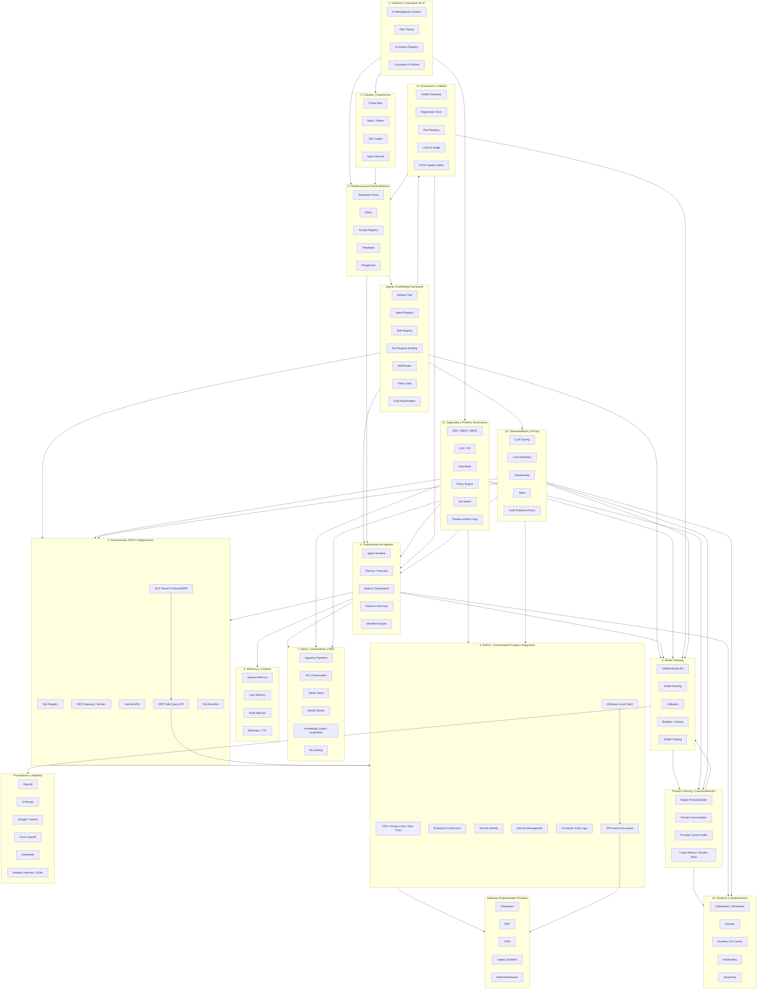

Aquí tienes la **nueva versión 2.4**, manteniendo el estilo claro de la anterior, pero ya corregida y ampliada con criterios de auditoría, gobierno, seguridad MCP, evaluación, runtime e inferencia. Tomé como base la versión original que compartiste. 

# Arquitectura de Plataformas de IA Internas — Versión 2.4 con Agentic Scaffolding Framework

**Fecha de corte:** 8 de julio de 2026
**Actualización de expansión:** 9 de julio de 2026
**Actualización de implementación:** 9 de julio de 2026
**Actualización de andamiaje agentic:** 9 de julio de 2026
**Tipo de documento:** Investigación arquitectónica y blueprint auditado
**Ámbito:** Plataformas internas de IA empresarial que consumen APIs externas, modelos internos, herramientas, datos corporativos y agentes autónomos o semiautónomos.

---

## Resumen Ejecutivo

Este documento presenta una versión ampliada y auditada de la arquitectura de plataformas internas de IA. La versión anterior cubría correctamente las capas principales de una plataforma de IA empresarial: API Gateway, orquestación de agentes, memoria, RAG, herramientas, seguridad, monitoreo de costos y APIs internas para desarrolladores. Sin embargo, para una arquitectura empresarial de 2026 se requiere una visión más completa: no basta con definir capas técnicas; también deben existir planos de gobierno, evaluación, seguridad runtime, gestión de riesgos, inferencia escalable, conectividad privada empresarial y control económico de caché.

La arquitectura propuesta en esta versión se organiza en **13 capas/planos**, una convención transversal de prompt caching sobre LiteLLM, patrones aterrizados para conectividad/ERP y un **Agentic Scaffolding Framework** para declarar agentes, skills, tools, políticas, routing, prompts y evaluaciones futuras sin rediseñar el runtime:

1. Gobierno corporativo de IA
2. Experiencia de usuario y canales internos
3. Plataforma interna para desarrolladores
4. Orquestación de aplicaciones y agentes
5. Herramientas, MCP e integraciones empresariales
6. Conectividad e integración empresarial de IA — EAICIL
7. Datos, conocimiento y RAG empresarial
8. Memoria, contexto y personalización
9. Model Gateway y gestión de proveedores
10. Runtime, inferencia e infraestructura
11. Seguridad, identidad y runtime governance
12. Evaluación, calidad y readiness gates
13. Observabilidad, FinOps y auditoría continua

La actualización incorpora cuatro ajustes prácticos para aterrizar el blueprint en una operación real: una capa explícita para conectar agentes con sistemas privados, un patrón transitorio de **Local Edge Connector usando la VPN del usuario** cuando todavía no existan credenciales de servicio por cliente, y una **ERP Safe Query API + MCP Server** para consultar Protheus/ERP sin exponer SQL libre ni acceso directo a base de datos. Además, la optimización de caché se recalibra: no se implementará una **Cache Intelligence Layer** como capa independiente; se usará **LiteLLM como Model Gateway** junto con una convención liviana de prompt caching, canonicalización, perfiles por proveedor/modelo y métricas reales de cache-hit/cache-miss. Finalmente, incorpora un **Agentic Scaffolding Framework** basado en LangGraph, Langfuse, LiteLLM, MCP, OpenAPI, JSON Schema/Pydantic y políticas declarativas para dejar preparado el andamiaje del Chat Principal, agentes especializados futuros, skills, tools, routing y eval placeholders. La versión 2.4 agrega además una expansión transversal con **componentes clave comentados, métricas operativas y patrones recomendados** para convertir el blueprint en un modelo implementable, gobernable y medible.

Esta estructura responde a la evolución reciente de los sistemas de IA: las empresas ya no están construyendo solo chatbots o wrappers sobre modelos externos; están construyendo **compound AI systems**, es decir, sistemas que combinan LLMs, herramientas, datos, retrievers, workflows, memoria, evaluaciones, conectores privados, caching y reglas de negocio. Los papers de Compound AI para empresa proponen precisamente pasar de modelos monolíticos a arquitecturas compuestas con registries, streams, agentes y orquestación empresarial. ([arXiv][1])

---

## Cambios Principales Frente a la Versión Anterior

La versión anterior era una buena base conceptual, pero esta versión corrige y amplía varios puntos críticos:

| Área       | Versión anterior                                       | Versión 2.4                                                                 |
| ---------- | ------------------------------------------------------ | --------------------------------------------------------------------------- |
| Fuentes    | Mezcla papers, blogs y vendors sin clasificación clara | Separa papers, estándares, documentación oficial y referencias comerciales  |
| Capas      | 8 capas funcionales                                    | 13 capas/planos auditables + convención transversal de caché sobre LiteLLM                 |
| Gobierno   | Seguridad y compliance general                         | Gobierno corporativo basado en ISO 42001, NIST AI RMF y marcos regulatorios |
| MCP        | MCP como integración                                   | MCP como superficie crítica de seguridad                                    |
| Conectividad privada | Implícita en herramientas o infraestructura | Capa EAICIL para identidades de servicio, conectores, VPN/site-to-site y redes privadas |
| Evaluación | Evaluation harness básico                              | Capa completa de quality gates, benchmarks, red teaming y regression tests  |
| Runtime    | Poco desarrollado                                      | Incluye inferencia, escalado, colas, streaming, caching y SLOs              |
| Agentes    | Orquestación general                                   | Incluye identidad, permisos, acciones delegadas y runtime governance        |
| Costos     | Token attribution                                      | FinOps completo: budgets, showback, chargeback, anomalías, límites duros y cache-aware routing |
| Caché      | Optimización técnica no diferenciada                   | Convención de prompt caching y canonicalización sobre LiteLLM; no se construye una capa independiente |
| Auditoría  | Logs generales                                         | Evidencia auditable, trazas, decisiones, datasets, versiones, políticas, herramientas, conectores y métricas de caché |
| Control plane | No diferenciado | AI Control Plane, Execution Policy Broker y Runtime Authorization para gobernar acciones en tiempo de ejecución |
| Componentes transversales | Implícitos en capas | Componentes clave con descripción clara, propósito operativo y relación con auditoría |
| Métricas operativas | Métricas distribuidas por capa | Métricas consolidadas de riesgo, calidad, seguridad, costo, caché, RAG, herramientas y agentes |
| Patrones de arquitectura | Patrones principales | Patrones ampliados para control plane, policy-as-code, step-up authorization, tool trust, evidencia y operación segura |
| VPN heterogénea por cliente | No contemplada | Patrón Local Edge Connector usando VPN del usuario como transición gobernada hasta credenciales de servicio |
| ERP / Protheus | No contemplado | Patrón ERP Safe Query API + MCP Server para consultas read-only, tipadas, auditables y sin SQL libre |
| LiteLLM y caché | Cache Intelligence como capa | LiteLLM como gateway; canonicalización y smoke tests para validar cache-hit real por proveedor/modelo |
| Agentic Scaffolding | No contemplado | Marco declarativo para Default Chat, Agent Registry, Skill Registry, Tool Registry, políticas, routing, prompts y eval placeholders |
| Chat Principal / Default | Chat genérico sin andamiaje | Default Chat como orquestador gobernado que puede responder, activar skills aprobadas o delegar a agentes futuros |
| LangGraph y Langfuse | Herramientas mencionadas | LangGraph como runtime de grafos/agentes y Langfuse como trazabilidad, prompt management y base para evals futuras |

---

## Fuentes Primarias y Marcos Consultados

### Papers y Arquitecturas Académicas / Técnicas

**A Blueprint Architecture of Compound AI Systems for Enterprise**
Propone una arquitectura para sistemas de IA compuestos en entornos empresariales, usando streams como mecanismo central de coordinación entre modelos, agentes, datos y herramientas. ([arXiv][1])

**Orchestrating Agents and Data for Enterprise**
Amplía la arquitectura de Compound AI con agent registry, data registry y componentes de orquestación para aplicaciones empresariales. ([arXiv][2])

**EnterpriseLab: A Full-Stack Platform for Developing and Deploying Agents in Enterprises**
Propone una plataforma full-stack para agentes empresariales, integrando herramientas, generación de trayectorias de entrenamiento, evaluación continua y despliegue de modelos pequeños especializados. ([arXiv][3])

**Kaman 3.0: Architecture of an Enterprise AI Agent Platform**
Describe una arquitectura empresarial con capas como LLM routing, core de agentes, MCP, data lake, memoria jerárquica, omnicanalidad y accountability. Debe tratarse como technical report, no necesariamente como paper revisado por pares. ([arXiv][3])

**Scalable Inference Architectures for Compound AI Systems**
Estudia infraestructura de inferencia para sistemas compuestos y agentic workflows, incluyendo fan-out multi-modelo, cold starts encadenados, autoscaling, serverless y reducción de latencia/costos. ([arXiv][4])

**Agentic Retrieval-Augmented Generation: A Survey on Agentic RAG**
Analiza la evolución de RAG hacia Agentic RAG, incorporando planificación, reflexión, uso de herramientas y colaboración multiagente. ([arXiv][5])

**GraphRAG**
Propone construir grafos de conocimiento sobre corpus privados para mejorar respuestas globales, síntesis y razonamiento sobre información empresarial compleja. ([arXiv][6])

**Self-RAG**
Introduce recuperación adaptativa y autocrítica durante la generación, útil para reducir respuestas no fundamentadas y mejorar factualidad. ([arXiv][7])

---

### Seguridad, Gobierno y Compliance

**ISO/IEC 42001:2023**
Estándar para sistemas de gestión de IA. Define cómo establecer, implementar, mantener y mejorar un sistema de gestión de IA dentro de una organización. ([ISO][8])

**NIST AI Risk Management Framework — Generative AI Profile**
NIST AI 600-1 define acciones para identificar y gestionar riesgos específicos de IA generativa. ([NIST][9])

**EU AI Act**
Marco regulatorio europeo basado en riesgo. Para plataformas internas, es relevante cuando la IA se usa en procesos de alto impacto como empleo, crédito, educación, salud, biometría, seguridad o decisiones que afectan derechos. ([Digital Strategy][10])

**OWASP Top 10 for LLM Applications 2025**
Enumera riesgos como prompt injection, insecure output handling, data poisoning, model denial of service, supply chain vulnerabilities, sensitive information disclosure y excessive agency. ([OWASP Gen AI Security Project][11])

---

### MCP, Herramientas y Agentes

**Model Context Protocol Specification 2025-06-18**
MCP es un protocolo abierto para conectar aplicaciones LLM con fuentes externas de datos y herramientas. ([Model Context Protocol][12])

**Enterprise-Grade Security for the Model Context Protocol**
Analiza amenazas empresariales de MCP y propone controles para tool poisoning, threat modeling y adopción segura. ([arXiv][13])

**SMCP: Secure Model Context Protocol**
Propone mejoras de seguridad para MCP: identidad unificada, autenticación mutua, propagación de contexto de seguridad, enforcement fino de políticas y audit logging. ([arXiv][14])

**MCPTox**
Benchmark de ataques de tool poisoning sobre servidores MCP reales. Evalúa 45 servidores MCP, 353 herramientas y 1312 casos maliciosos. ([arXiv][15])

---

### Evaluación y Benchmarks Empresariales

**CRMArena-Pro**
Benchmark para agentes en escenarios empresariales de ventas, servicio y CPQ, con interacciones multi-turn y evaluación de confidencialidad. ([arXiv][16])

**AgentArch**
Evalúa 18 configuraciones agentic distintas en tareas empresariales, analizando orquestación, estilo de agente, memoria y thinking tools. ([arXiv][17])

**EnterpriseClawBench**
Benchmark de agentes empresariales construido a partir de sesiones reales de trabajo, con 852 tareas reproducibles y evaluación centrada en artefactos, costo, runtime y calidad. ([arXiv][18])

**BankerToolBench**
Evalúa agentes en workflows completos de banca de inversión, con entregables multiarchivo como Excel, PowerPoint, Word y PDFs. ([arXiv][19])

---

## Principios de Diseño

La plataforma debe seguir estos principios:

1. **Abstracción de proveedores:** ningún equipo interno debe depender directamente de una API externa concreta.
2. **Seguridad por defecto:** todo acceso a datos, herramientas y modelos debe estar autenticado, autorizado y auditado.
3. **Gobierno runtime:** no basta con aprobar el caso de uso; hay que controlar qué hace el agente durante la ejecución.
4. **Evaluación antes de producción:** ningún prompt, agente, workflow o modelo debe promoverse sin pruebas.
5. **Trazabilidad completa:** cada respuesta debe poder reconstruirse: modelo, prompt, herramientas, datos recuperados, usuario, costo y versión.
6. **Cost control nativo:** budgets, límites duros y alertas deben formar parte de la arquitectura, no de un dashboard posterior.
7. **Human-in-the-loop proporcional al riesgo:** acciones irreversibles o sensibles requieren aprobación humana.
8. **Mínimo privilegio:** agentes y herramientas solo reciben permisos por tarea, duración y contexto.
9. **Arquitectura híbrida:** combinar APIs externas, modelos internos, SLMs, embeddings, rerankers y reglas determinísticas.
10. **Auditoría continua:** la plataforma debe producir evidencia usable por seguridad, legal, compliance, finanzas y arquitectura.
11. **Conectividad privada gobernada y progresiva:** el estado objetivo es usar identidades de servicio y conectores controlados; mientras eso no exista por cliente, puede usarse un Local Edge Connector que aproveche la VPN activa del usuario sin capturar credenciales.
12. **Caché como convención sobre el gateway:** no se construye una capa independiente; LiteLLM opera como Model Gateway y la plataforma define reglas de prompt estable, canonicalización, perfiles por proveedor/modelo y métricas de cache-hit.
13. **ERP protegido por API segura:** los agentes no deben consultar directamente la base ni ejecutar SQL libre; deben usar herramientas MCP que consuman una ERP Safe Query API con allowlist, policy guard, sanitización y auditoría.
14. **Andamiaje declarativo de agentes:** los agentes, skills, tools, prompts, políticas y rutas deben declararse mediante manifiestos versionados y validados, no hardcodearse dentro del runtime.
15. **Default Chat gobernado:** el Chat Principal puede activar skills y delegar a agentes, pero no debe ejecutar tools directamente ni operar fuera de políticas.
16. **Evaluaciones preparadas, no necesariamente definidas:** el framework debe incluir placeholders y contratos para evals futuras sin obligar a definir datasets reales desde el inicio.

---


## Expansión 2.4 — Componentes Clave, Métricas y Patrones Comentados

**Descripción:**
Esta sección agrega una expansión transversal al blueprint. No reemplaza las 13 capas originales; las complementa con componentes, métricas y patrones que ayudan a pasar de una arquitectura conceptual a una plataforma operable, auditable y controlada en producción.

**Criterio de lectura:**
Cada elemento incluye una descripción breve para aclarar qué hace, para qué sirve o qué controla dentro de la arquitectura.

---

### 2.4.1 Componentes Clave Expandidos

| Capa o plano | Componente clave | Comentario / descripción breve |
| --- | --- | --- |
| Gobierno corporativo | **AI Control Plane** | Plano central que aplica políticas, riesgo, límites, aprobaciones y trazabilidad sobre agentes, modelos, herramientas y conectores. |
| Gobierno corporativo | **AI System Contract** | Ficha obligatoria por sistema de IA que documenta propósito, owner, datos, modelos, herramientas, riesgos, SLOs y controles. |
| Gobierno corporativo | **Risk Decision Engine** | Motor que clasifica casos de uso por riesgo y decide si requieren aprobación, evaluación, red teaming o human-in-the-loop. |
| Gobierno corporativo | **AI Policy Catalog** | Catálogo versionado de políticas corporativas aplicables a modelos, datos, agentes, herramientas, proveedores y usuarios. |
| Gobierno corporativo | **Exception Management Workflow** | Flujo formal para aprobar excepciones, registrar riesgos aceptados y definir fecha de expiración o revisión. |
| Plataforma para desarrolladores | **AI Golden Paths** | Plantillas oficiales para construir casos comunes como chatbot RAG, agente con herramientas, agente con aprobación humana o copiloto interno. |
| Plataforma para desarrolladores | **Prompt & Tool Schema Registry** | Registro versionado de prompts, instrucciones, tool schemas, políticas y cambios para evitar drift no controlado. |
| Plataforma para desarrolladores | **AI Application Template Store** | Repositorio de aplicaciones base aprobadas que acelera desarrollo sin saltarse seguridad, logging, evaluación y costos. |
| Plataforma para desarrolladores | **Developer Risk Checklist** | Checklist previo al despliegue que obliga a validar datos, permisos, herramientas, modelos, métricas y riesgos del caso de uso. |
| Orquestación de agentes | **Agent Capability Registry** | Catálogo de capacidades permitidas por agente: qué puede leer, escribir, ejecutar, aprobar, consultar o escalar. |
| Orquestación de agentes | **Execution Policy Broker** | Componente que valida cada paso del agente antes de ejecutar herramientas, llamadas externas, acciones sensibles o conectores privados. |
| Orquestación de agentes | **Agent State Store** | Almacén durable del estado del agente para pausar, reanudar, auditar y recuperar workflows interrumpidos. |
| Orquestación de agentes | **Agent Plan Validator** | Valida el plan del agente antes de ejecutarlo, especialmente cuando hay herramientas, sistemas privados o acciones irreversibles. |
| Orquestación de agentes | **Task Boundary Controller** | Define límites de pasos, tokens, tiempo, costo, herramientas y alcance permitido por tarea. |
| Agentic Scaffolding | **Agentic Scaffolding Framework** | Marco declarativo que permite registrar agentes, skills, tools, prompts, políticas, routing y eval placeholders sin reescribir el runtime. |
| Agentic Scaffolding | **Default Chat / Default Agent** | Punto de entrada principal que entiende intención, responde directo, activa skills aprobadas o delega a agentes especializados futuros. |
| Agentic Scaffolding | **Agent Registry** | Catálogo declarativo de agentes disponibles, su propósito, estado, skills habilitadas, límites, políticas y ownership. |
| Agentic Scaffolding | **Skill Registry** | Catálogo de capacidades reutilizables que agrupan prompts, herramientas, políticas y lógica de ejecución por dominio. |
| Agentic Scaffolding | **Tool Registry Binding** | Vincula tools declaradas con MCP, OpenAPI, REST interno, Local Edge Connector o ERP Safe Query API. |
| Agentic Scaffolding | **Agent Manifest** | Contrato versionado que define un agente: nombre, propósito, runtime, skills, permisos, observabilidad y eval placeholder. |
| Agentic Scaffolding | **Skill Manifest** | Contrato versionado que define una skill: intención, inputs, outputs, tools necesarias, restricciones y políticas. |
| Agentic Scaffolding | **Tool Manifest** | Contrato versionado que define una herramienta: schema, adaptador, permisos, riesgo, auditoría y restricciones de seguridad. |
| Agentic Scaffolding | **Skill Router** | Componente que decide si el Default Chat responde directo, activa una skill o deriva a un agente especializado. |
| Agentic Scaffolding | **Policy Gate** | Valida usuario, cliente, entorno, skill, tool, datos y riesgo antes de ejecutar acciones o llamadas a herramientas. |
| Agentic Scaffolding | **Graph Templates** | Plantillas LangGraph reutilizables para responder, usar tools, pedir aprobación humana, manejar errores o ejecutar flujos multi-step. |
| Agentic Scaffolding | **Eval Placeholders** | Espacios preparados para evaluaciones futuras por agente, skill y tool, sin definir todavía datasets reales. |
| Agentic Scaffolding | **Observability Hooks** | Hooks obligatorios para enviar trazas de agente, skill, tool, prompt, modelo, costo y decisión a Langfuse/OpenTelemetry. |
| Herramientas y MCP | **Tool Trust Registry** | Registro de herramientas confiables con owner, permisos, criticidad, schema, versión, entorno y nivel de riesgo. |
| Herramientas y MCP | **Tool Metadata Scanner** | Escáner que detecta instrucciones ocultas, tool poisoning o metadatos maliciosos antes de exponer herramientas a agentes. |
| Herramientas y MCP | **Tool Permission Matrix** | Matriz que separa permisos de lectura, escritura, borrado, envío externo, ejecución y administración por herramienta. |
| Herramientas y MCP | **Tool Invocation Ledger** | Registro auditable de cada invocación de herramienta con usuario, agente, parámetros, resultado, política aplicada y costo. |
| Herramientas y MCP | **MCP Server Admission Control** | Proceso para aprobar, firmar, escanear y monitorear servidores MCP antes de conectarlos a la plataforma. |
| Herramientas y MCP | **Agent Skill** | Define el comportamiento del agente, instrucciones, casos de uso permitidos y cuándo usar cada herramienta. |
| Herramientas y MCP | **MCP Server Protheus/ERP** | Expone herramientas al agente usando MCP; no contiene lógica libre de SQL, solo llama a la API segura. |
| Herramientas y MCP | **ERP Safe Query API** | API REST controlada que traduce consultas permitidas a operaciones internas contra ERP, API REST o base de datos. |
| Herramientas y MCP | **Endpoint Catalog** | Catálogo de endpoints permitidos, con descripción, parámetros, permisos, límites y owner. |
| Herramientas y MCP | **Table / Field Allowlist** | Lista explícita de tablas y campos consultables; bloquea cualquier tabla o columna no aprobada. |
| Herramientas y MCP | **Query Template Engine** | Ejecuta consultas predefinidas o parametrizadas, no SQL generado libremente por el modelo. |
| EAICIL | **Connector Policy Broker** | Controla qué agente puede usar qué conector, contra qué sistema, con qué identidad y bajo qué política. |
| EAICIL | **Service Identity Vault** | Gestiona identidades técnicas por agente, aplicación, entorno y conector, evitando credenciales personales. |
| EAICIL | **Private Connectivity Manager** | Administra conexiones privadas como VPN site-to-site, PrivateLink, Zero Trust Networking o VPC endpoints. |
| EAICIL | **Connector Data Filter** | Filtra datos sensibles o no autorizados antes de devolver resultados al agente o al modelo. |
| EAICIL | **Connector Kill Switch** | Permite cortar un conector específico sin apagar toda la plataforma ni afectar otros dominios. |
| EAICIL | **Windows Local Client** | Aplicación local que ejecuta conectores dentro del entorno de red del usuario cuando la VPN está activa. |
| EAICIL | **Local Connector Runtime** | Ejecuta herramientas aprobadas contra ERP, API REST o base de datos sin exponer acceso directo al modelo. |
| EAICIL | **VPN Detection Layer** | Verifica conectividad hacia endpoints internos antes de ejecutar acciones. |
| EAICIL | **Tool Allowlist Local** | Define qué herramientas puede ejecutar el cliente local y bloquea comandos arbitrarios. |
| EAICIL | **Service Connector Future Mode** | Evolución futura donde el conector corre en un servidor del cliente con credencial propia de servicio. |
| Datos y RAG | **Retrieval Quality Service** | Evalúa calidad de recuperación, relevancia, frescura, permisos y evidencia usada en respuestas RAG. |
| Datos y RAG | **Source Authority Registry** | Clasifica fuentes por autoridad: oficial, secundaria, obsoleta, experimental, sensible o no confiable. |
| Datos y RAG | **ACL Synchronization Service** | Sincroniza permisos de documentos y sistemas fuente para que RAG no exponga información no autorizada. |
| Datos y RAG | **RAG Freshness Monitor** | Detecta documentos vencidos, índices desactualizados, duplicados o fuentes que ya no deben usarse. |
| Datos y RAG | **Grounding Evidence Builder** | Construye la evidencia que soporta una respuesta: documentos, fragmentos, metadatos, fechas y nivel de confianza. |
| Memoria y contexto | **Memory Governance Service** | Decide qué se puede guardar, cuánto tiempo, quién puede leerlo y cuándo debe borrarse. |
| Memoria y contexto | **Context Assembly Service** | Construye el contexto final del modelo mezclando instrucciones, memoria, RAG, tools y datos dinámicos de forma controlada. |
| Memoria y contexto | **Memory Redaction Filter** | Elimina secretos, PII o información sensible antes de guardar memoria persistente. |
| Memoria y contexto | **Context Compression Engine** | Resume o compacta contexto para reducir tokens sin perder información relevante. |
| Memoria y contexto | **Tenant Memory Isolation** | Aísla memoria por usuario, equipo, aplicación, tenant o dominio para evitar contaminación cruzada. |
| Model Gateway | **Risk-Aware Model Router** | Selecciona modelo según riesgo, datos, costo, latencia, región, calidad esperada y soporte de caché. |
| Model Gateway | **Model Policy Firewall** | Bloquea modelos, regiones, proveedores, parámetros o capacidades no autorizadas para un caso de uso específico. |
| Model Gateway | **Provider Health Monitor** | Monitorea disponibilidad, errores, latencia, costos y degradación de proveedores externos o modelos internos. |
| Model Gateway | **Model Capability Registry** | Documenta qué modelos soportan herramientas, visión, razonamiento, JSON estricto, caching, streaming o fine-tuning. |
| Model Gateway | **Fallback Decision Engine** | Decide cuándo cambiar de modelo o proveedor por caída, latencia, costo, riesgo o baja calidad. |
| Prompt Caching y Canonicalización | **Stable Prompt Builder** | Construye el bloque estable reutilizable: system prompt, políticas, tool schemas, instrucciones base, ejemplos y contexto común. |
| Prompt Caching y Canonicalización | **Prompt Canonicalizer** | Ordena y serializa de forma determinística tools, schemas, políticas y bloques de contexto para evitar cache misses por diferencias accidentales. |
| Prompt Caching y Canonicalización | **Provider Cache Profile** | Define cómo activar o aprovechar caché por proveedor/modelo: OpenAI automático + `prompt_cache_key`, Anthropic `cache_control`, Gemini implicit/explicit caching, DeepSeek context caching automático y `user_id` para aislamiento. |
| Prompt Caching y Canonicalización | **Cache Metrics Dashboard** | Mide `cached_tokens`, `cache_read_input_tokens`, `cache_creation_input_tokens`, `cache_hit_rate`, latencia, costo efectivo y ahorro por proveedor/modelo. |
| Prompt Caching y Canonicalización | **Cache Smoke Tests** | Pruebas automáticas que envían la misma request dos veces y validan que la segunda produce cache-hit real en cada proveedor/modelo soportado. |
| Runtime e infraestructura | **Agent SLO Controller** | Controla latencia, disponibilidad, concurrencia, timeouts, tokens máximos, pasos máximos y límites de costo. |
| Runtime e infraestructura | **Sandbox Execution Broker** | Ejecuta código, consultas o herramientas peligrosas en entornos aislados y auditables. |
| Runtime e infraestructura | **Backpressure Controller** | Reduce o bloquea nuevas cargas cuando el sistema está saturado para evitar cascadas de fallos. |
| Runtime e infraestructura | **Request Coalescing Layer** | Agrupa solicitudes repetidas o equivalentes para reducir costo y presión sobre modelos o herramientas. |
| Runtime e infraestructura | **Workload Classifier** | Separa cargas interactivas, batch, agentic, evaluación, RAG e inferencia interna para escalar mejor. |
| Seguridad y governance runtime | **Runtime Authorization Engine** | Autoriza cada acción del agente en tiempo de ejecución, no solo al iniciar la sesión. |
| Seguridad y governance runtime | **Prompt Injection Firewall** | Detecta instrucciones maliciosas en documentos, inputs, outputs y resultados de herramientas. |
| Seguridad y governance runtime | **Sensitive Data Boundary** | Define qué datos pueden salir a modelos externos, quedarse internos o bloquearse completamente. |
| Seguridad y governance runtime | **Action Risk Scorer** | Calcula riesgo de una acción según datos, sistema destino, reversibilidad, usuario, agente y contexto. |
| Seguridad y governance runtime | **Tamper-Evident Audit Log** | Guarda eventos de auditoría protegidos contra manipulación para investigaciones y compliance. |
| Evaluación y calidad | **Evaluation-as-Code Framework** | Convierte evaluaciones de prompts, RAG, tools, seguridad y workflows en pruebas automáticas de CI/CD. |
| Evaluación y calidad | **Agent Trajectory Evaluator** | Evalúa no solo la respuesta final, sino la secuencia completa de pasos, herramientas, decisiones y errores. |
| Evaluación y calidad | **Regression Dataset Manager** | Gestiona datasets de regresión por dominio para detectar degradación al cambiar modelos, prompts o herramientas. |
| Evaluación y calidad | **Red Team Automation Suite** | Automatiza pruebas de prompt injection, jailbreak, tool poisoning, fuga de datos y excessive agency. |
| Evaluación y calidad | **Readiness Scorecard** | Resume si un agente está listo para producción según calidad, seguridad, costo, latencia y trazabilidad. |
| Observabilidad y FinOps | **AI Evidence Store** | Almacén auditable con trazas, prompts, modelos, versiones, decisiones, herramientas, costos, políticas y fuentes. |
| Observabilidad y FinOps | **AI FinOps Ledger** | Libro contable de consumo por usuario, equipo, aplicación, agente, modelo, proveedor, caché y caso de uso. |
| Observabilidad y FinOps | **Quality Drift Monitor** | Detecta degradación de calidad, groundedness, precisión de herramientas o satisfacción de usuarios. |
| Observabilidad y FinOps | **Cost Anomaly Detector** | Detecta aumentos inusuales de tokens, llamadas, retries, loops, herramientas o proveedores caros. |
| Observabilidad y FinOps | **Audit Evidence Pack Builder** | Genera paquetes de evidencia para auditoría con trazas, políticas, owners, datasets, resultados y cambios. |
| Operación | **Kill Switch Orchestrator** | Permite desactivar agente, herramienta, conector, modelo, proveedor o caso de uso sin apagar toda la plataforma. |
| Operación | **Incident Playbook Manager** | Define procedimientos para incidentes de fuga de datos, costos anómalos, prompt injection o acciones indebidas. |
| Operación | **Change Impact Analyzer** | Evalúa impacto antes de cambiar modelo, prompt, herramienta, conector, política o índice RAG. |
| Operación | **Rollback Controller** | Permite volver a una versión anterior de prompt, modelo, agente, herramienta o política. |
| Operación | **Operational Readiness Review** | Revisión previa a producción que valida soporte, monitoreo, escalamiento, ownership y respuesta a incidentes. |

---

### 2.4.2 Métricas Recomendadas con Comentarios

| Categoría | Métrica | Comentario / descripción breve |
| --- | --- | --- |
| Gobierno | **AI inventory coverage** | Porcentaje de sistemas, agentes, modelos y herramientas registrados frente al total real detectado. |
| Gobierno | **Risk classification coverage** | Porcentaje de casos de uso con nivel de riesgo definido, owner asignado y controles mínimos documentados. |
| Gobierno | **Policy exception count** | Número de excepciones activas a políticas estándar; ayuda a detectar deuda de riesgo. |
| Gobierno | **Expired exception rate** | Porcentaje de excepciones vencidas que siguen operando sin revisión formal. |
| Gobierno | **Approval lead time** | Tiempo promedio desde solicitud de aprobación hasta decisión humana o comité. |
| Runtime governance | **Policy decision latency** | Tiempo que tarda el motor de políticas en permitir, bloquear o escalar una acción. |
| Runtime governance | **Runtime policy block rate** | Porcentaje de acciones bloqueadas por políticas durante la ejecución. |
| Runtime governance | **Step-up authorization rate** | Porcentaje de acciones que requirieron autorización adicional por aumento de riesgo. |
| Runtime governance | **Human approval rate** | Porcentaje de ejecuciones que necesitaron aprobación humana antes de continuar. |
| Runtime governance | **HITL override rate** | Porcentaje de veces que un humano modificó, rechazó o corrigió la decisión del agente. |
| Agentes | **Agent autonomy score** | Nivel de autonomía del agente según acciones permitidas, herramientas disponibles y necesidad de aprobación. |
| Agentes | **Agent step count** | Número de pasos ejecutados por tarea; ayuda a detectar complejidad excesiva o loops. |
| Agentes | **Loop detection count** | Número de ejecuciones donde el agente repite pasos sin avanzar hacia el objetivo. |
| Agentes | **Task completion rate** | Porcentaje de tareas completadas correctamente sin intervención manual innecesaria. |
| Agentes | **Escalation rate** | Porcentaje de tareas derivadas a humanos por baja confianza, riesgo o falta de evidencia. |
| Agentic Scaffolding | **Manifest validation pass rate** | Porcentaje de manifiestos de agentes, skills y tools que pasan validación de schema, política y seguridad. |
| Agentic Scaffolding | **Skill routing accuracy** | Mide si el Default Chat seleccionó la skill correcta para la intención del usuario. |
| Agentic Scaffolding | **Agent delegation accuracy** | Mide si la delegación a un agente especializado fue necesaria y correcta. |
| Agentic Scaffolding | **Default chat direct resolution rate** | Porcentaje de solicitudes resueltas por el Chat Principal sin activar skills ni delegar. |
| Agentic Scaffolding | **Skill activation rate** | Frecuencia con la que cada skill es activada por agente, usuario, cliente y caso de uso. |
| Agentic Scaffolding | **Eval placeholder coverage** | Porcentaje de agentes, skills y tools con plantilla de evaluación futura asignada. |
| Agentic Scaffolding | **Prompt-version trace linkage** | Porcentaje de ejecuciones donde la traza queda ligada a la versión exacta de prompt usada. |
| Herramientas | **Tool exposure index** | Cantidad y criticidad de herramientas disponibles para un agente en una ejecución. |
| Herramientas | **Tool-call accuracy** | Porcentaje de llamadas correctas a herramientas según intención, parámetros y resultado esperado. |
| Herramientas | **Unauthorized tool-call blocked rate** | Porcentaje de intentos de uso no autorizado bloqueados por políticas. |
| Herramientas | **Tool error rate** | Porcentaje de llamadas a herramientas que fallan por parámetros inválidos, timeout, permisos o error del sistema. |
| Herramientas | **Tool-call storm count** | Número de eventos donde un agente invoca demasiadas herramientas en poco tiempo. |
| MCP | **MCP server trust score** | Puntuación de confianza del servidor MCP según origen, revisión, firma, vulnerabilidades y comportamiento. |
| MCP | **Tool metadata risk findings** | Hallazgos de riesgo en descripciones, schemas o metadatos de herramientas. |
| MCP | **Tool poisoning detection rate** | Porcentaje de intentos o pruebas de tool poisoning detectados por controles. |
| EAICIL | **Connector access violation rate** | Intentos bloqueados de acceso a sistemas privados por falta de permisos o política. |
| EAICIL | **Connector-call count** | Número de llamadas a conectores privados por agente, usuario, aplicación y sistema destino. |
| EAICIL | **Service identity usage rate** | Porcentaje de accesos ejecutados con identidad de servicio en lugar de credenciales personales. |
| EAICIL | **Connector data redaction rate** | Porcentaje de resultados donde se filtró o redactó información sensible antes de responder al agente. |
| EAICIL | **Private connectivity availability** | Disponibilidad de túneles, Private Links, VPC endpoints o redes privadas usadas por IA. |
| EAICIL | **Local connector execution count** | Número de ejecuciones realizadas mediante Windows Local Client usando VPN activa del usuario. |
| EAICIL | **VPN reachability success rate** | Porcentaje de validaciones donde el cliente local logra alcanzar ERP, API REST o base de datos del cliente. |
| EAICIL | **Audit sync delay** | Tiempo entre la ejecución local y la sincronización de evidencia hacia el SaaS. |
| ERP Safe API | **Blocked free-query attempts** | Intentos bloqueados de ejecutar SQL libre, consultar tabla libre o usar parámetros no permitidos. |
| ERP Safe API | **Allowed endpoint usage** | Uso por endpoint seguro, cliente, usuario, agente y caso de uso. |
| ERP Safe API | **Result sanitization rate** | Porcentaje de respuestas donde se filtró, paginó, resumió o enmascaró información antes de devolverla al agente. |
| Seguridad | **Secrets exposure incidents** | Número de secretos detectados en prompts, outputs, logs, tool results o memoria. |
| Seguridad | **Prompt injection detection rate** | Porcentaje de ataques o instrucciones maliciosas detectadas en entradas directas o indirectas. |
| Seguridad | **Sensitive data block rate** | Porcentaje de solicitudes o respuestas bloqueadas por contener información sensible no permitida. |
| Seguridad | **Unauthorized action attempt rate** | Frecuencia de acciones intentadas fuera del propósito, permiso o riesgo permitido. |
| Seguridad | **Audit log completeness** | Porcentaje de eventos críticos con usuario, agente, herramienta, política, timestamp y resultado registrados. |
| RAG | **ACL leakage rate** | Casos donde RAG intenta devolver información que el usuario no debería ver; debe tender a cero. |
| RAG | **Retrieval precision@k** | Proporción de documentos relevantes dentro de los primeros resultados recuperados. |
| RAG | **Retrieval recall@k** | Capacidad de recuperar documentos relevantes disponibles dentro de los primeros resultados. |
| RAG | **Citation support rate** | Porcentaje de afirmaciones importantes respaldadas por fuentes recuperadas. |
| RAG | **Groundedness score** | Medida de cuánto la respuesta se apoya realmente en evidencia disponible. |
| RAG | **Freshness score** | Evalúa si las fuentes usadas están actualizadas para la pregunta del usuario. |
| RAG | **Stale source usage rate** | Porcentaje de respuestas que usaron fuentes vencidas, antiguas o superadas por versiones nuevas. |
| Memoria | **Memory write acceptance rate** | Porcentaje de memorias propuestas que pasan reglas de privacidad, utilidad y retención. |
| Memoria | **Memory redaction count** | Número de datos sensibles removidos antes de guardar memoria. |
| Memoria | **Memory retrieval relevance** | Mide si las memorias recuperadas fueron útiles para la tarea actual. |
| Memoria | **Cross-tenant memory violation rate** | Casos donde se intenta acceder a memoria de otro tenant, equipo o usuario sin autorización. |
| Contexto | **Context utilization ratio** | Porcentaje del contexto enviado al modelo que realmente contribuye a la respuesta. |
| Contexto | **Context compression ratio** | Reducción de tokens lograda al compactar contexto sin perder información crítica. |
| Contexto | **Instruction/data separation score** | Evalúa si instrucciones del sistema, datos recuperados y entradas del usuario están correctamente separadas. |
| Model Gateway | **Model routing accuracy** | Porcentaje de solicitudes enviadas al modelo correcto según tarea, riesgo, costo y calidad. |
| Model Gateway | **Provider fallback rate** | Frecuencia con la que el gateway cambia a otro proveedor por error, latencia, costo o política. |
| Model Gateway | **Model policy violation count** | Intentos de usar modelos, regiones, parámetros o capacidades no aprobadas. |
| Model Gateway | **Effective model cost** | Costo real por modelo considerando caché, output, retries, latencia y éxito de tarea. |
| Caché | **Cache eligibility rate** | Porcentaje del prompt que puede ser cacheado de forma segura. |
| Caché | **Cache hit rate** | Porcentaje de tokens o prefijos reutilizados por caché. |
| Caché | **Cache miss reason distribution** | Distribución de causas de fallo de caché: prompt variable, versión nueva, datos sensibles o proveedor. |
| Caché | **Cost avoided by cache** | Ahorro estimado gracias a prompt caching, KV-cache o reutilización de resultados. |
| Caché | **Latency improvement from cache** | Reducción de latencia atribuible a caché. |
| Caché | **Cache smoke test pass rate** | Porcentaje de modelos/proveedores donde una segunda request idéntica demuestra cache-hit real. |
| Caché | **Stable prefix hash reuse** | Frecuencia con la que se reutiliza el mismo hash de prefijo estable por tenant, app y prompt_version. |
| Caché | **Provider cache reliability** | Mide si el proveedor/modelo reporta consistentemente tokens cacheados y descuento real en costo/latencia. |
| Runtime | **P50 / P95 / P99 latency** | Latencia de punta a punta para respuestas o workflows completos. |
| Runtime | **Time to first token** | Tiempo hasta que el usuario recibe el primer token en respuestas streaming. |
| Runtime | **Retry rate** | Porcentaje de pasos repetidos por error, timeout o respuesta inválida. |
| Runtime | **Queue wait time** | Tiempo promedio que una tarea espera antes de ejecutarse. |
| Runtime | **Backpressure activation count** | Número de veces que el sistema limitó carga para evitar saturación. |
| FinOps | **Cost per successful task** | Costo real dividido entre tareas completadas correctamente, no solo costo por llamada. |
| FinOps | **Budget burn rate** | Velocidad de consumo del presupuesto por equipo, app, agente o modelo. |
| FinOps | **Runaway agent cost** | Costo generado por loops, retries excesivos o tareas fuera de control. |
| FinOps | **Showback coverage** | Porcentaje del costo total atribuible a usuario, equipo, aplicación, agente y modelo. |
| FinOps | **Chargeback readiness** | Nivel de preparación para imputar costos formalmente a unidades de negocio. |
| Evaluación | **Evaluation pass rate** | Porcentaje de pruebas superadas antes de promover a producción. |
| Evaluación | **Regression failure rate** | Porcentaje de pruebas que fallan después de cambiar modelo, prompt, herramienta o política. |
| Evaluación | **Red-team block rate** | Porcentaje de ataques simulados bloqueados correctamente. |
| Evaluación | **Agent trajectory quality score** | Calidad de la secuencia completa de decisiones, herramientas y pasos del agente. |
| Evaluación | **Readiness score** | Puntuación agregada de preparación para producción: calidad, seguridad, costo, latencia y trazabilidad. |
| Observabilidad | **Trace completeness rate** | Porcentaje de ejecuciones con traza completa de usuario, modelo, prompt, herramienta, fuente, costo y política. |
| Observabilidad | **Evidence pack completeness** | Porcentaje de auditorías con evidencia suficiente para reconstruir decisiones. |
| Observabilidad | **Quality drift rate** | Velocidad con la que disminuyen métricas de calidad frente a una línea base. |
| Observabilidad | **Incident detection time** | Tiempo desde que ocurre una anomalía hasta que es detectada. |
| Observabilidad | **Incident recovery time** | Tiempo desde la detección hasta mitigación, rollback o apagado controlado. |
| Experiencia | **User satisfaction score** | Señal de satisfacción, utilidad percibida y confianza del usuario final. |
| Experiencia | **User correction rate** | Porcentaje de respuestas corregidas por usuarios, útil para detectar baja calidad. |
| Experiencia | **Abandonment rate** | Porcentaje de sesiones abandonadas antes de completar la tarea. |

---

### 2.4.3 Patrones Recomendados con Comentarios

| Patrón | Comentario / descripción breve |
| --- | --- |
| **Control Plane / Data Plane Separation** | Separa el plano que decide políticas del plano que ejecuta modelos, herramientas y conectores. |
| **Policy-as-Code Everywhere** | Define reglas de acceso, riesgo, modelo, herramienta y datos como políticas versionadas y auditables. |
| **Least Tools at Runtime** | El agente solo recibe las herramientas necesarias para la tarea actual, no todo el catálogo disponible. |
| **Step-up Authorization** | Si una acción aumenta el riesgo, se exige permiso adicional, autenticación reforzada o aprobación humana. |
| **Read-before-Write** | Antes de modificar sistemas, el agente debe leer contexto, validar intención y confirmar impacto. |
| **Plan-then-Execute** | El agente primero genera un plan verificable y luego ejecuta pasos bajo control de políticas. |
| **Agentic Scaffolding Framework** | Deja listo el andamiaje para crear agentes especializados, skills, tools, políticas y evals futuras mediante manifiestos versionados. |
| **Manifest-driven Agentic Architecture** | Define agentes, skills y tools como contratos declarativos validados antes de ser cargados por el runtime. |
| **Default Chat as Governed Orchestrator** | El Chat Principal actúa como entrada universal, pero solo activa skills o delega bajo reglas y políticas explícitas. |
| **Tools Only via Skills** | Las tools técnicas no se exponen directamente al Default Chat; se consumen mediante skills aprobadas. |
| **Eval Placeholder by Design** | Cada agente, skill y tool debe tener espacio preparado para evaluación futura aunque el dataset real todavía no exista. |
| **Human-in-the-Loop by Risk** | Las acciones irreversibles, financieras, legales, externas o sensibles requieren aprobación humana. |
| **Idempotent Agent Actions** | Las acciones deben poder repetirse sin causar duplicados, daños o efectos secundarios inesperados. |
| **Compensating Actions** | Si una acción parcial falla, debe existir una acción de reversa o compensación. |
| **Circuit Breaker for Agents** | Corta ejecuciones con demasiados errores, pasos, costo, latencia o riesgo acumulado. |
| **Budget Guardrail** | Bloquea o degrada tareas cuando se supera presupuesto, tokens, runtime o costo por tarea. |
| **RAG with ACL Preservation** | El sistema de recuperación respeta permisos originales de documentos y sistemas fuente. |
| **Evidence-First Answering** | Para dominios críticos, el agente responde solo si tiene evidencia suficiente y trazable. |
| **Source Authority Ranking** | Prioriza fuentes oficiales, recientes y autorizadas sobre documentos duplicados, antiguos o no confiables. |
| **Context Minimization** | Envía al modelo solo el contexto necesario para reducir costo, fuga de datos y ruido. |
| **Stable Prefix Prompting** | Ubica instrucciones, políticas y tool schemas estables al inicio para mejorar caché y consistencia. |
| **Prompt Caching y Canonicalización sobre LiteLLM** | Usa LiteLLM como gateway y una convención liviana de prefijos estables, perfiles por proveedor/modelo y pruebas de cache-hit real. |
| **Sensitive Data Exclusion from Cache** | Excluye PII, secretos, datos de usuario y contenido altamente variable de bloques cacheables. |
| **Fallback Cascade** | Si falla un modelo o proveedor, cambia a otro según reglas de riesgo, costo, región y calidad. |
| **Degraded Mode** | Si una capacidad falla, el sistema sigue funcionando con menos autonomía, solo lectura o sin herramientas críticas. |
| **Canary Release for Agents** | Libera cambios de prompts, modelos o herramientas a un subconjunto reducido antes del rollout total. |
| **Evaluation-as-Code** | Las evaluaciones viven en repositorio, corren en CI/CD y bloquean despliegues inseguros. |
| **Audit Event Sourcing** | Cada decisión y acción se registra como evento reconstruible para auditoría. |
| **Signed Tool Metadata** | Los schemas y descripciones de herramientas se firman para prevenir manipulación o tool poisoning. |
| **Connector Façade** | El agente nunca accede directo al sistema privado; siempre pasa por un conector gobernado. |
| **Local Edge Connector usando VPN del Usuario** | Permite operar de forma transitoria con un cliente Windows que aprovecha la VPN activa del trabajador, sin capturar credenciales ni ejecutar acciones libres. |
| **ERP Safe Query API + MCP Server** | Expone capacidades seguras del ERP mediante API REST tipada y MCP, evitando SQL libre y acceso directo a base de datos. |
| **Kill Switch by Scope** | Permite apagar solo un agente, herramienta, modelo, proveedor o conector específico. |
| **Runtime Authorization per Step** | Cada paso del agente se autoriza individualmente según contexto, usuario, herramienta, datos y riesgo. |
| **Tool Trust Admission** | Ninguna herramienta entra al catálogo sin owner, schema, revisión, pruebas, logging y nivel de criticidad. |
| **Private Connectivity by Service Identity** | Los agentes acceden a redes privadas usando identidades técnicas, no sesiones humanas ni credenciales personales. |
| **Zero Standing Privileges for Agents** | Los agentes no tienen permisos permanentes amplios; reciben acceso temporal y contextual. |
| **Data Boundary Enforcement** | Aplica límites claros sobre qué datos pueden salir a modelos externos, quedarse internos o ser bloqueados. |
| **Prompt/Data Separation** | Separa instrucciones del sistema, datos recuperados y entrada del usuario para reducir prompt injection. |
| **Grounded RAG Response Contract** | Obliga a que respuestas RAG incluyan evidencia, fuentes, nivel de confianza y manejo de incertidumbre. |
| **Freshness-Aware Retrieval** | El retrieval considera fecha, versión, vigencia y autoridad de la fuente, no solo similitud semántica. |
| **Memory TTL by Sensitivity** | La memoria expira según sensibilidad, utilidad y política de retención. |
| **Memory Inspection and Deletion** | Permite inspeccionar, corregir y borrar memoria persistente según política y derechos del usuario. |
| **Cache Isolation by Tenant** | Evita que prefijos cacheables mezclen datos entre usuarios, equipos, aplicaciones o tenants. |
| **Effective Cost Routing** | El gateway elige modelo por costo efectivo real, incluyendo caché, retries, latencia y tasa de éxito. |
| **Workload Segmentation** | Separa workloads interactivos, batch, agentic, evaluación e inferencia interna para mejorar escalabilidad. |
| **Async Job Pattern for Long Tasks** | Tareas largas se ejecutan con colas, checkpoints, estado durable y notificación de resultado. |
| **Observability by Default** | Toda ejecución genera trazas, métricas, logs, costos y evidencia desde el primer día. |
| **Rollback-Ready Deployment** | Todo cambio de modelo, prompt, política, herramienta o conector debe poder revertirse rápidamente. |
| **Incident Playbooks for AI** | Define respuestas concretas para fuga de datos, prompt injection, costo anómalo, tool misuse y caída de proveedor. |
| **Operational Readiness Review** | Antes de producción se revisa soporte, monitoreo, alertas, owner, escalamiento y kill switch. |

---

### 2.4.4 Priorización de Implementación

| Prioridad | Elementos a implementar | Comentario / razón |
| --- | --- | --- |
| **P0** | AI Control Plane, Policy Engine, Runtime Authorization, Evidence Store | Sin estos elementos no hay gobierno real, autorización por acción ni auditoría confiable. |
| **P0** | Tool Trust Registry, MCP Admission Control, Tool Metadata Scanner | Reduce riesgos de tool poisoning, herramientas no autorizadas y abuso de capacidades. |
| **P0** | Agentic Scaffolding Framework, Default Chat, Agent Registry, Skill Registry, Tool Registry Binding | Deja listo el mecanismo para crear agentes especializados y skills sin rediseñar el runtime. |
| **P0** | LangGraph Runtime Templates, Policy Gate, Manifest Schema Validation | Permite cargar configuraciones de agentes/skills/tools con validación, control y ejecución gobernada. |
| **P1** | Langfuse Observability Hooks, Prompt Registry Binding, Eval Placeholders | Prepara trazabilidad, versionado de prompts y evaluaciones futuras sin definir datasets reales todavía. |
| **P0** | EAICIL, Service Identity Vault, Connector Policy Broker | Evita credenciales personales y controla acceso de agentes a sistemas privados. |
| **P0** | ERP Safe Query API, MCP Server Protheus/ERP, Table/Field Allowlist | Permite consultar ERP de forma segura, read-only, auditable y sin SQL libre. |
| **P1** | Windows Local Client, VPN Detection Layer, Local Connector Runtime | Entrega valor mientras cada cliente habilita credenciales de servicio o conectores dedicados. |
| **P0** | RAG con ACL, DLP, Prompt Injection Firewall, Kill Switch | Mitiga fuga de datos, acceso indebido, prompt injection y acciones peligrosas. |
| **P1** | Evaluation-as-Code, Agent Trajectory Evaluator, Red Team Automation | Convierte calidad y seguridad en gates repetibles antes de producción. |
| **P1** | FinOps Ledger, Budget Guardrails, Cost per Successful Task | Permite controlar gasto, detectar runaway agents y justificar valor de negocio. |
| **P1** | Observability by Default, Trace Completeness, Evidence Packs | Permite reconstruir decisiones y responder a auditorías o incidentes. |
| **P1** | LiteLLM, Stable Prompt Builder, Prompt Canonicalizer, Provider Cache Profile, Cache Smoke Tests | Optimiza costo y latencia sin construir una capa independiente de caché; valida cache-hit real por proveedor/modelo. |
| **P2** | Source Authority Registry, Freshness Scoring, Memory Governance | Mejora precisión, actualidad y personalización sin comprometer privacidad. |
| **P2** | Change Impact Analyzer, Rollback Controller, Operational Readiness Review | Fortalece operación continua, cambios seguros y resiliencia de producción. |

---

### 2.4.5 Mapa de Integración con las 13 Capas

| Expansión transversal | Capas impactadas | Comentario / descripción breve |
| --- | --- | --- |
| **AI Control Plane** | 1, 3, 4, 5, 9, 11, 12, 13 | Une gobierno, desarrollo, ejecución, seguridad, evaluación y auditoría bajo políticas comunes. |
| **Execution Policy Broker** | 4, 5, 6, 11 | Controla acciones del agente en runtime antes de usar herramientas o conectores. |
| **Agentic Scaffolding Framework** | 2, 3, 4, 5, 9, 11, 12, 13 | Conecta Default Chat, registries, skills, tools, políticas, prompts, modelos, trazas y eval placeholders. |
| **Tool Trust Registry** | 5, 11, 13 | Mantiene inventario seguro y auditable de herramientas expuestas a agentes. |
| **Connector Policy Broker** | 5, 6, 11, 13 | Asegura que cada acceso privado esté autorizado, trazado y asociado a identidad de servicio. |
| **Retrieval Quality Service** | 7, 11, 12, 13 | Mide si RAG recupera fuentes correctas, autorizadas, frescas y útiles. |
| **Memory Governance Service** | 8, 11, 13 | Evita que memoria persistente se convierta en fuga de datos o contaminación entre usuarios. |
| **Risk-Aware Model Router** | 9, 10, 11, 13 | Selecciona modelos según riesgo, calidad, costo, región, latencia y caché. |
| **Prompt Caching y Canonicalización** | 9, 10, 11, 13 | Optimiza costo y latencia sobre LiteLLM mediante prefijos estables, perfiles por proveedor/modelo y métricas reales de cache-hit. |
| **Local Edge Connector usando VPN del Usuario** | 2, 5, 6, 11, 13 | Permite consultar sistemas privados aprovechando la VPN activa del usuario como transición gobernada. |
| **ERP Safe Query API + MCP Server** | 4, 5, 6, 11, 12, 13 | Expone capacidades del ERP mediante herramientas semánticas, API REST segura, allowlist, policy guard y auditoría. |
| **Evaluation-as-Code** | 3, 4, 5, 7, 9, 12 | Bloquea cambios inseguros o de baja calidad antes de producción. |
| **AI Evidence Store** | 4, 5, 6, 7, 9, 11, 12, 13 | Centraliza evidencia para auditoría, incidentes, debugging y compliance. |
| **AI FinOps Ledger** | 9, 10, 12, 13 | Mide costo real por tarea, equipo, modelo, proveedor, caché y resultado de negocio. |
| **Kill Switch Orchestrator** | 4, 5, 6, 9, 10, 11 | Permite contención rápida ante incidentes sin apagar toda la plataforma. |

---


### 2.4.6 Agentic Scaffolding Framework

**Descripción:**
El **Agentic Scaffolding Framework** es el andamiaje declarativo que permite crear, registrar y gobernar agentes, skills, tools, prompts, políticas, rutas y evaluaciones futuras sin modificar el núcleo del runtime.

No se define todavía un catálogo real de agentes especializados ni datasets reales de evaluación. La intención es dejar preparado el marco para que esos elementos puedan agregarse después mediante manifiestos versionados, validados y observables.

**Estado de la industria:**
Actualmente no existe un estándar único universal para definir agentes, skills, tools, routing, políticas y evals de punta a punta. El patrón recomendado es combinar estándares y herramientas de facto:

| Necesidad | Recomendación | Comentario / descripción breve |
| --- | --- | --- |
| Runtime de agentes | **LangGraph** | Ejecuta grafos, estado, tool calls, human-in-the-loop, reintentos y flujos multi-step. |
| Observabilidad y mejora continua | **Langfuse** | Registra trazas, versiones de prompts, costos, scores y datasets futuros para evaluación. |
| Gateway de modelos | **LiteLLM** | Centraliza modelos, proveedores, fallback, budgets, rate limits, costos y prompt caching medido. |
| Tools para agentes | **MCP** | Expone tools, resources y prompts a agentes mediante un contrato estándar de integración. |
| APIs internas | **OpenAPI 3.1** | Documenta y valida APIs REST como la ERP Safe Query API. |
| Schemas | **JSON Schema / Pydantic** | Valida parámetros, manifiestos, inputs/outputs y contratos de tools. |
| Políticas | **OPA/Rego o Cedar** | Permite separar decisiones de autorización del código del agente. |
| Trazabilidad estándar | **OpenTelemetry + Langfuse** | Mantiene trazas técnicas y de IA correlacionadas sin depender de un único vendor. |
| Persistencia de configuración | **Git + Postgres** | Git versiona manifiestos; Postgres puede servirlos al runtime en producción. |

**Arquitectura conceptual:**

```text
Chat Principal / Default Agent
        ↓
Intent Classifier / Skill Router
        ↓
LangGraph Runtime
        ↓
Policy Gate
        ↓
Skill Registry
        ↓
Tool Registry
        ↓
MCP / OpenAPI / ERP Safe Query API / Local Edge Connector
        ↓
LiteLLM
        ↓
Langfuse + OpenTelemetry
```

**Componentes mínimos:**

| Componente | Descripción |
| --- | --- |
| **Default Chat / Default Agent** | Punto de entrada principal. Puede responder directo, activar skills aprobadas o delegar a agentes especializados futuros. |
| **Agent Registry** | Catálogo declarativo de agentes disponibles, su estado, propósito, owner, runtime, límites, skills y políticas. |
| **Skill Registry** | Catálogo de capacidades reutilizables que agrupan prompts, tools, reglas, inputs, outputs y restricciones. |
| **Tool Registry** | Catálogo de herramientas técnicas disponibles vía MCP, OpenAPI, REST interno, Local Edge Connector o ERP Safe Query API. |
| **Prompt Registry Binding** | Vincula agentes y skills con versiones concretas de prompts gestionadas en Git o Langfuse. |
| **Routing Rules** | Define cuándo el Default Chat responde directo, activa una skill o delega a otro agente. |
| **Policy Gate** | Autoriza o bloquea acciones según usuario, cliente, entorno, agente, skill, tool, datos y riesgo. |
| **Graph Templates** | Plantillas LangGraph para patrones comunes: respuesta directa, tool call, HITL, diagnóstico, consulta ERP y error handling. |
| **Tool Adapters** | Adaptadores hacia MCP, OpenAPI, REST interno, Windows Local Client, ERP Safe Query API u otros conectores. |
| **Eval Placeholders** | Plantillas vacías para evaluaciones futuras por agente, skill y tool; no contienen datasets reales todavía. |
| **Observability Hooks** | Hooks que envían trazas de agente, skill, tool, modelo, prompt, costo y decisión a Langfuse/OpenTelemetry. |
| **Manifest Schema Validation** | Validación automática de manifiestos antes de cargar agentes, skills o tools al runtime. |

**Regla principal:**

El Default Chat no debe tener acceso libre a todas las tools. Debe activar skills aprobadas, y las skills son las que consumen tools permitidas.

```text
Correcto:
Default Chat → Skill aprobada → Tools permitidas → Policy Gate → Ejecución

Incorrecto:
Default Chat → cualquier tool directa → ejecución sin skill ni política
```

**Manifiestos mínimos:**

El framework debe soportar al menos estos contratos declarativos:

| Manifiesto | Propósito |
| --- | --- |
| **Agent Manifest** | Define un agente: propósito, runtime, skills habilitadas, límites, políticas, observabilidad y eval placeholder. |
| **Skill Manifest** | Define una skill: intenciones, inputs, outputs, tools requeridas, restricciones, políticas y eval placeholder. |
| **Tool Manifest** | Define una tool: schema, adaptador, endpoint, permisos, riesgo, auditoría y restricciones de seguridad. |
| **Policy Manifest** | Define reglas de ejecución: read-only, requiere aprobación, bloqueado, local-only, SaaS-only o service-identity. |
| **Routing Manifest** | Define reglas de selección de skill o delegación a agente especializado. |
| **Eval Template Manifest** | Define el espacio para evaluación futura, sin obligar todavía a cargar datasets reales. |

**Ejemplo mínimo de Agent Manifest:**

```yaml
id: default_chat
name: Chat Principal
type: default_orchestrator
status: active

runtime:
  framework: langgraph
  graph: default_chat_graph

capabilities:
  can_answer_general_questions: true
  can_use_skills: true
  can_delegate_to_agents: true
  can_execute_tools_directly: false

enabled_skills:
  - erp_query_skill_example

tool_access_policy:
  mode: deny_by_default
  allow_only_via_skills: true

observability:
  provider: langfuse
  trace_all_interactions: true
  log_skill_selection: true
  log_tool_calls: true
  log_model_calls: true
  log_costs: true

evals:
  status: placeholder
  template: agent_eval_template
```

**Ejemplo mínimo de Skill Manifest:**

```yaml
id: erp_query_skill_example
name: Consulta ERP Demo
status: example

description: >
  Skill de ejemplo para consultar información del ERP mediante
  una API segura y tools MCP aprobadas.

execution:
  mode: read_only
  graph: skill_execution_graph
  requires_human_approval: false

tools:
  - consultar_cliente_example
  - consultar_parametro_sx6_example

output_policy:
  summarize_results: true
  mask_sensitive_fields: true
  max_rows: 20

evals:
  status: placeholder
  template: skill_eval_template
```

**Ejemplo mínimo de Tool Manifest:**

```yaml
id: consultar_cliente_example
name: Consultar Cliente
status: example

type: mcp_tool
adapter: openapi_rest

mcp:
  server: protheus_erp_mcp_example
  tool_name: consultar_cliente

openapi:
  operation_id: getClienteByCodigo
  method: GET
  path: /api/clientes/{codigo_cliente}

risk:
  level: low
  operation_type: read

permissions:
  mode: read_only
  requires_human_approval: false

security:
  allow_sql_freeform: false
  allow_dynamic_table_access: false
  mask_sensitive_fields: true

audit:
  log_request: true
  log_response_summary: true
  log_user: true
  log_client: true
```

**Reglas obligatorias:**

1. El Default Chat puede activar skills, pero no ejecutar cualquier tool directamente.
2. Todo agente, skill y tool debe tener manifiesto versionado.
3. Todo manifiesto debe validarse contra schema antes de producción.
4. Las tools deben operar con deny-by-default y mínimo privilegio.
5. Cada skill debe declarar qué tools puede usar y bajo qué política.
6. Cada agente debe declarar si puede delegar a otros agentes.
7. Las evals reales pueden diferirse, pero el placeholder debe existir desde el inicio.
8. Toda ejecución debe trazarse en Langfuse/OpenTelemetry.
9. Toda llamada a modelo debe pasar por LiteLLM o gateway equivalente.
10. Toda tool externa debe pasar por MCP, OpenAPI, ERP Safe Query API o conector aprobado.

**Uso inicial recomendado:**

* Un Default Chat real.
* Un Agent Registry real pero con pocos agentes.
* Un Skill Registry real con ejemplos desactivables.
* Un Tool Registry real con tools de ejemplo.
* Manifiestos y schemas desde el inicio.
* Evals solo como placeholders.
* LangGraph como runtime.
* Langfuse como trazabilidad y preparación para evaluación futura.
* LiteLLM como gateway de modelos.
* MCP/OpenAPI como contratos de herramientas.

---

# Capas Arquitectónicas Recomendadas

---

## 1. Capa de Gobierno Corporativo de IA

**Descripción:**
Define cómo la organización aprueba, clasifica, monitorea y controla el uso de IA. Es el plano superior de gobierno y debe existir antes de escalar agentes en producción.

**Componentes clave:**

* AI governance board o comité de IA
* Clasificación de casos de uso por riesgo
* Registro central de sistemas de IA
* Inventario de modelos, proveedores, datasets, agentes y herramientas
* Mapeo regulatorio: ISO 42001, NIST AI RMF, EU AI Act, GDPR, SOC2, HIPAA, según aplique
* Políticas de uso aceptable
* Matriz de responsabilidades: negocio, legal, seguridad, data, arquitectura, plataforma
* Proceso de aprobación para casos de uso de alto riesgo
* Evaluaciones de impacto
* Gestión de excepciones y risk acceptance

**Patrones recomendados:**

* Crear un **AI System Registry** con owner, propósito, usuarios, datos usados, modelos, herramientas, proveedores y nivel de riesgo.
* Definir categorías de riesgo: bajo, medio, alto, crítico.
* Exigir evaluación previa para casos que afecten empleo, crédito, salud, seguridad, pagos, decisiones legales o atención al cliente regulada.
* Mantener trazabilidad entre sistema, modelo, prompt, dataset, herramientas y políticas aplicadas.
* Alinear el sistema de gestión con ISO/IEC 42001 y NIST AI RMF. ([ISO][8])

**Preguntas de auditoría:**

* ¿Existe un inventario completo de sistemas y agentes de IA?
* ¿Cada agente tiene owner de negocio y owner técnico?
* ¿Está documentado el propósito permitido del sistema?
* ¿Existe clasificación de riesgo?
* ¿Hay proceso de aprobación antes de producción?
* ¿Se puede demostrar qué políticas aplicaban en una ejecución concreta?

---

## 2. Capa de Experiencia de Usuario y Canales Internos

**Descripción:**
Permite que empleados, equipos y sistemas consuman capacidades de IA desde canales controlados: portal web, Slack, Teams, IDE, CRM, ERP, email, herramientas internas o APIs.

**Componentes clave:**

* Chat interno corporativo
* Integración con Slack / Teams
* Extensiones para IDE
* Portal de autoservicio
* Widgets embebidos en aplicaciones internas
* Interfaces para agentes especializados
* Autenticación corporativa
* Gestión de sesión
* Consentimiento y banners de uso
* Historial de conversaciones según políticas de retención
* Omnicanalidad con contexto compartido

**Patrones recomendados:**

* Evitar que cada equipo construya su propio chatbot aislado.
* Centralizar identidad y permisos.
* Mostrar al usuario cuándo está hablando con un agente, qué datos puede usar y qué acciones puede ejecutar.
* Separar canales de bajo riesgo, como consulta documental, de canales de alto riesgo, como ejecución de acciones.
* Permitir handoff humano cuando el agente no tiene confianza suficiente.

**Preguntas de auditoría:**

* ¿El usuario sabe qué sistema de IA está usando?
* ¿El canal hereda los permisos reales del usuario?
* ¿Se registran conversaciones y acciones según política corporativa?
* ¿Hay disclaimers o controles para casos sensibles?
* ¿Se puede revocar acceso por canal, equipo o aplicación?

---

## 3. Capa de Plataforma Interna para Desarrolladores

**Descripción:**
Proporciona a los equipos internos una forma estándar de construir aplicaciones de IA sin reinventar autenticación, logging, integración con modelos, RAG, herramientas, evaluación y costos.

**Componentes clave:**

* Developer portal
* SDKs en Python, TypeScript, Java o lenguajes internos
* Catálogo de modelos
* Catálogo de herramientas
* Prompt registry
* Plantillas de agentes
* Quickstarts
* Sandbox de desarrollo
* Playground de modelos y prompts
* Documentación de patrones aprobados
* Librerías comunes de guardrails
* CI/CD para prompts, agentes y workflows

**Patrones recomendados:**

* Crear “golden paths” para casos típicos: chatbot documental, agente de soporte, copiloto de código, agente de reporting, workflow con aprobación humana.
* Versionar prompts como artefactos, no como strings hardcodeados.
* Integrar evaluación automática en pull requests.
* Separar entornos: dev, staging, prod.
* Exigir que todo agente nuevo se registre antes de producción.
* Permitir self-service, pero con límites y políticas centrales.

**Herramientas posibles:**

* Langfuse para prompt management, trazas, evaluaciones y experimentos. ([Langfuse][20])
* LangSmith para observabilidad, evaluación y monitoreo de aplicaciones LLM. ([Docs by LangChain][21])
* Promptfoo, OpenAI Evals, DeepEval o frameworks internos para evaluación.
* Docusaurus, Backstage o portal interno para documentación.

**Preguntas de auditoría:**

* ¿Los desarrolladores tienen SDKs oficiales?
* ¿Los prompts están versionados?
* ¿Hay ambiente de pruebas seguro?
* ¿Las aplicaciones nuevas pasan por evaluación antes de producción?
* ¿Se bloquea el uso directo de APIs externas no gobernadas?

---

## 4. Capa de Orquestación de Aplicaciones y Agentes

**Descripción:**
Coordina workflows, agentes, herramientas, memoria, datos y modelos. Esta capa decide cómo se descompone una tarea, qué pasos se ejecutan, qué herramientas se invocan, cuándo se pide aprobación humana y cómo se recupera una ejecución fallida.

**Componentes clave:**

* Agent runtime
* LangGraph runtime
* Default Chat / Default Agent
* Skill Router
* Agent Registry
* Skill Registry
* Tool Registry binding
* Agent Manifest / Skill Manifest / Tool Manifest
* Graph Templates
* Eval Placeholders
* Planner / executor
* Graph-based orchestration
* Workflow engine
* State management
* Checkpointing
* Durable execution
* Human-in-the-loop
* Multi-agent coordination
* Event sourcing
* Task queues
* Retry policies
* Compensating actions
* Timeouts
* Dead-letter queues

**Patrones recomendados:**

* Usar orquestación basada en grafos para workflows complejos.
* Separar planificación de ejecución en tareas de alto riesgo.
* Guardar estado después de cada paso importante.
* Incluir aprobación humana antes de acciones irreversibles.
* Diseñar workflows idempotentes.
* Usar compensating actions cuando una acción parcial deba revertirse.
* Evitar agentes con autonomía ilimitada.
* Usar un Agentic Scaffolding Framework para que agentes, skills, tools y políticas se definan por manifiestos, no por código hardcodeado.
* Mantener el Default Chat como orquestador gobernado: puede activar skills o delegar, pero no ejecutar tools libremente.
* Preparar eval placeholders por agente, skill y tool aunque todavía no existan datasets reales.

LangGraph documenta persistencia, checkpointers, stores y human-in-the-loop para guardar estado, pausar workflows y continuar ejecuciones con intervención humana. ([Docs by LangChain][22])

**Preguntas de auditoría:**

* ¿El agente puede explicar qué plan siguió?
* ¿Se registra cada herramienta invocada?
* ¿Puede reanudarse una ejecución fallida?
* ¿Hay límites de pasos, tokens, tiempo y costo?
* ¿Hay aprobación humana para acciones sensibles?
* ¿Puede detenerse un agente en ejecución?
* ¿Cada agente, skill y tool tiene manifiesto versionado?
* ¿El Default Chat solo ejecuta tools mediante skills aprobadas?
* ¿Las ejecuciones quedan trazadas en Langfuse/OpenTelemetry?

---

## 5. Capa de Herramientas, MCP e Integraciones Empresariales

**Descripción:**
Permite que agentes y aplicaciones interactúen con sistemas internos mediante herramientas tipadas, MCP servers aprobados, APIs internas y conectores empresariales. Para el caso de Protheus/ERP, esta capa debe evitar acceso directo a base de datos y SQL libre: el patrón recomendado es **Agent Skill + MCP Server + ERP Safe Query API**.

**Principio central:**
El agente no ejecuta consultas libres ni accede directamente al ERP. El agente invoca herramientas MCP semánticas, y esas herramientas llaman a una API REST segura que controla permisos, tablas, campos, límites, sanitización y auditoría.

**Arquitectura recomendada para ERP / Protheus:**

```text
Agent Skill
   ↓
MCP Server Protheus/ERP
   ↓
ERP Safe Query API
   ↓
ERP / Protheus / API REST / Base de datos controlada
```

**Componentes clave:**

* Tool registry
* MCP gateway
* MCP servers internos
* MCP Server Protheus/ERP
* Agent Skills por dominio
* ERP Safe Query API
* Endpoint Catalog
* Table Allowlist
* Field Allowlist
* Query Template Engine
* Policy Guard
* Result Sanitizer
* Audit Logger
* Conectores REST, GraphQL, gRPC
* Integración con ERP, CRM, HRIS, ITSM, BI y data warehouse
* Schemas tipados para herramientas
* Validación de inputs/outputs
* Sandboxing
* Tool permissions
* Tool result caching
* Separación de herramientas read-only y write-capable

**Patrones recomendados:**

* Toda herramienta debe estar registrada con owner, descripción, schema, permisos, criticidad y logging.
* Las herramientas deben ser semánticas: `consultar_cliente`, `consultar_pedido`, `consultar_parametro_sx6`, no `ejecutar_sql`.
* El MCP no debe acceder directamente a la base de datos.
* Las consultas al ERP deben pasar por una **ERP Safe Query API**.
* Solo se permiten tablas y campos en allowlist.
* Las respuestas deben tener límite de filas, paginación, timeout y sanitización.
* Las herramientas de escritura requieren políticas más estrictas y aprobación humana.
* MCP debe tratarse como superficie crítica de seguridad, no solo como protocolo de integración.
* Validar metadatos de herramientas para prevenir tool poisoning.
* Revisar servidores MCP externos antes de conectarlos.
* Mantener allowlists de herramientas y servidores aprobados.

**Ejemplos de herramientas correctas:**

```text
consultar_cliente(codigo_cliente)
consultar_pedido(numero_pedido)
consultar_producto(codigo_producto)
consultar_parametro_sx6(nombre_parametro)
consultar_diccionario_tabla(nombre_tabla)
buscar_titulos_abiertos(codigo_cliente)
consultar_logs_integracion(id_proceso)
```

**Ejemplos prohibidos:**

```text
ejecutar_sql(sql)
consultar_tabla_libre(nombre_tabla)
actualizar_registro(tabla, campo, valor)
borrar_registro(tabla, id)
hacer_select_generico(query)
```

MCP permite conectar aplicaciones LLM con herramientas y datos externos, pero los papers recientes muestran riesgos específicos como tool poisoning, prompt injection, escalamiento de privilegios y ataques de supply chain. ([Model Context Protocol][12])

**Preguntas de auditoría:**

* ¿Existe inventario de todas las herramientas expuestas a agentes?
* ¿Cada herramienta tiene permisos mínimos?
* ¿El MCP Server Protheus/ERP llama únicamente a endpoints aprobados?
* ¿Existe ERP Safe Query API con allowlist de tablas y campos?
* ¿Se bloquea SQL libre o consulta genérica de tablas?
* ¿Se validan schemas y outputs?
* ¿Los MCP servers están autenticados?
* ¿Se monitorea tool poisoning?
* ¿Las herramientas críticas requieren aprobación humana?
* ¿Existe kill switch por herramienta?

## 6. Capa de Conectividad e Integración Empresarial de IA — EAICIL

**Descripción:**
La **Enterprise AI Connectivity & Integration Layer (EAICIL)** conecta de forma segura la plataforma interna de IA con los sistemas privados de la organización: bases de datos, ERP, CRM, APIs internas, data warehouses, servidores legacy y aplicaciones ubicadas detrás de redes restringidas.

En el estado objetivo, los agentes, runtimes y servicios de IA deben operar con identidades técnicas, conectividad privada persistente, conectores controlados y políticas de acceso verificables. Sin embargo, en clientes reales puede existir una fase transitoria: cada cliente usa un cliente VPN distinto —FortiClient, WireGuard, VPN nativa de Windows u otros— y todavía no siempre es viable crear credenciales de servicio o identidades de agente.

Por esa razón, la arquitectura admite un patrón temporal: **Local Edge Connector usando VPN del Usuario**.

**Relación con la Capa 5:**
La Capa 5 define las herramientas, MCP servers y contratos funcionales que los agentes pueden invocar. EAICIL define **cómo esas herramientas llegan de forma segura a sistemas privados** sin exponer redes internas directamente al modelo ni usar credenciales dentro del prompt.

**Arquitectura transitoria:**

```text
SaaS / Control Plane
    ↓
Windows Local Client
    ↓
VPN activa del usuario
    ↓
ERP / API REST / Base de datos del cliente
```

**Arquitectura objetivo:**

```text
SaaS / Control Plane
    ↓
Edge Connector por cliente
    ↓
Credencial de servicio / identidad técnica
    ↓
ERP / API REST / Base de datos del cliente
```

**Componentes clave:**

* Private network connectivity
* VPN site-to-site
* WireGuard
* IPSec
* Tailscale / Headscale
* Private Links
* Zero Trust Networking
* Windows Local Client
* Local Connector Runtime
* VPN Detection Layer
* Tool Allowlist Local
* Read-only First Mode
* Local Policy Guard
* Result Sanitizer
* Audit Sync
* Service Connector Future Mode
* Enterprise connector layer
* Conectores SQL/NoSQL controlados
* Conectores ERP, CRM, HRIS, ITSM y sistemas financieros
* Conectores para APIs internas y sistemas legacy
* MCP Gateway empresarial
* Service identity por agente, aplicación, cliente y entorno
* Secrets management centralizado
* Auditoría de conexión, consulta y acción
* Kill switch por conexión, conector o herramienta

**Patrones recomendados:**

* La primera versión debe permitir **read-only** para diagnóstico, consultas y soporte asistido.
* El cliente local nunca debe capturar ni almacenar credenciales de VPN del usuario.
* La VPN la inicia el usuario con el cliente oficial del cliente: FortiClient, WireGuard, Windows VPN u otro.
* El cliente local solo aprovecha la conectividad ya disponible en el sistema operativo.
* El SaaS no debe enviar SQL libre ni comandos arbitrarios.
* Toda acción debe pasar por herramientas tipadas y allowlist.
* Las acciones de escritura deben requerir aprobación humana.
* Las credenciales de ERP o base de datos no deben guardarse en prompts.
* Las trazas deben registrar usuario, cliente, herramienta, endpoint y resultado.
* El patrón local no debe usarse como infraestructura 24/7 ni para automatización crítica.
* El estado objetivo es migrar a un Edge Connector instalado en servidor, VM o entorno controlado del cliente.

**Uso recomendado del Local Edge Connector:**

* Diagnóstico de bugs.
* Consulta de estado del ERP.
* Lectura de diccionarios, parámetros, tablas o logs.
* Validación de conectividad.
* Soporte asistido por usuario.
* Generación de recomendaciones a partir de datos consultados localmente.

**Uso no recomendado:**

* Automatización autónoma sin usuario presente.
* Escrituras directas en producción.
* Procesos batch críticos.
* Dependencia de laptops para operación permanente.
* Acceso sin auditoría a base de datos.
* Ejecución de SQL generado libremente por un modelo.

**Herramientas posibles:**

* Windows Local Client / Edge Runner
* HashiCorp Vault
* Azure Key Vault
* AWS Secrets Manager
* Google Secret Manager
* Tailscale / Headscale
* WireGuard
* FortiClient / VPN nativa de Windows como conectividad iniciada por usuario
* IPSec / VPN site-to-site
* PrivateLink / Private Service Connect / VPC endpoints
* OPA, Cedar o motores equivalentes de policy-as-code

**Preguntas de auditoría:**

* ¿La plataforma usa identidad de servicio o modo transitorio con usuario presente?
* ¿El cliente local evita capturar credenciales de VPN?
* ¿Cada agente tiene permisos definidos por herramienta, sistema y entorno?
* ¿Las conexiones VPN o privadas son gobernadas y auditables?
* ¿Existe separación entre lectura, escritura, borrado y ejecución?
* ¿Los secretos están centralizados y rotados cuando existan credenciales de servicio?
* ¿Puede saberse qué agente accedió a qué sistema y con qué propósito?
* ¿Existe kill switch por conexión, conector o herramienta?
* ¿Los conectores filtran información antes de devolverla al agente?
* ¿El patrón local tiene plan de migración hacia Edge Connector con identidad de servicio?

## 7. Capa de Datos, Conocimiento y RAG Empresarial

**Descripción:**
Gestiona la ingesta, indexación, recuperación y grounding de conocimiento corporativo. Es la capa que conecta a los modelos con información actualizada y autorizada.

**Componentes clave:**

* Data ingestion pipelines
* Conectores a documentos, wikis, tickets, código, emails y bases de datos
* Clasificación de datos
* Preservación de ACLs
* Vector stores
* Embedding services
* Hybrid search
* Re-ranking
* Knowledge graphs
* GraphRAG
* Chunking inteligente
* Metadata y lineage
* Freshness management
* Eliminación y actualización de documentos
* Evaluación de retrieval

**Patrones recomendados:**

* Preservar permisos de origen: si un usuario no puede ver un documento en SharePoint, tampoco debe verlo vía RAG.
* Combinar búsqueda semántica y keyword.
* Usar re-ranking para mejorar precisión.
* Incluir freshness y versionado.
* Registrar qué documentos fueron recuperados para cada respuesta.
* Medir retrieval hit rate, groundedness, citation quality y hallucination rate.
* Usar GraphRAG cuando existan preguntas globales sobre corpus grandes, relaciones entre entidades o conocimiento narrativo complejo. ([arXiv][6])

**Evolución recomendada:**

* RAG básico: recuperación vectorial simple.
* RAG avanzado: hybrid search, re-ranking, metadata filters.
* Modular RAG: routers, query rewriting, multi-hop retrieval.
* Agentic RAG: agentes que planifican, recuperan, verifican y refinan la respuesta. ([arXiv][5])
* Self-reflective RAG: recuperación bajo demanda y crítica de evidencia. ([arXiv][7])

**Preguntas de auditoría:**

* ¿Se respetan permisos de documentos?
* ¿Se sabe qué fuentes sustentan cada respuesta?
* ¿Hay control de versiones del índice?
* ¿Se eliminan documentos obsoletos?
* ¿Se mide calidad de recuperación?
* ¿Hay protección contra data poisoning?
* ¿Hay pruebas de hallucination y groundedness?

---

## 8. Capa de Memoria, Contexto y Personalización

**Descripción:**
Administra la memoria de corto, medio y largo plazo para conversaciones, usuarios, equipos, agentes y aplicaciones. Debe mejorar continuidad sin violar privacidad ni aislamiento de datos.

**Componentes clave:**

* Working memory
* Session memory
* User memory
* Team memory
* Organizational memory
* Long-term memory stores
* Summarization de memoria
* Context compression
* Context window management
* TTL y políticas de expiración
* Consentimiento
* Borrado de memoria
* Aislamiento multi-tenant
* Memory inspection tools

**Patrones recomendados:**

* Separar memoria conversacional de memoria persistente.
* No guardar PII o datos sensibles sin base legal o política interna.
* Usar TTL por tipo de memoria.
* Permitir inspección y borrado.
* Evitar compartir memoria entre usuarios sin autorización.
* Guardar hechos, preferencias y contexto de trabajo de forma estructurada.
* No usar memoria como sustituto de RAG para conocimiento corporativo oficial.

**Preguntas de auditoría:**

* ¿Qué tipo de memoria se guarda?
* ¿Quién puede leerla?
* ¿Cuánto tiempo se conserva?
* ¿El usuario puede solicitar borrado?
* ¿La memoria está aislada por tenant/equipo?
* ¿Se evita guardar secretos?
* ¿Hay logs de lectura/escritura de memoria?

---

## 9. Capa de Model Gateway y Gestión de Proveedores

**Descripción:**
Abstrae modelos externos e internos detrás de una interfaz común. Gestiona routing, fallback, costos, límites, políticas, trazabilidad de uso y optimización por caché. En esta versión, el gateway recomendado es **LiteLLM**, y la optimización de caché se implementa como convención liviana de prompts estables y canonicalización, no como una capa independiente.

**Decisión arquitectónica:**
No se implementará una **Cache Intelligence Layer** como capa separada. La optimización de caché se resolverá mediante:

* LiteLLM como Model Gateway.
* Reglas de construcción de prompts estables.
* Canonicalización determinística.
* Perfiles por proveedor/modelo.
* Métricas de cache-hit/cache-miss.
* Smoke tests por proveedor/modelo.

**Componentes clave:**

* Unified model API
* LiteLLM Proxy
* Catálogo de modelos
* Routing por tarea
* Routing por costo
* Routing por latencia
* Routing por riesgo
* Routing por cache hit rate real
* Fallback entre proveedores
* Traffic splitting
* A/B testing
* Rate limits
* Quotas
* Budget enforcement
* Prompt normalization
* Response normalization
* Model allowlist / denylist
* Moderation models
* Embedding models
* Rerankers
* Stable Prompt Builder
* Prompt Canonicalizer
* Provider Cache Profile
* Cache Metrics Dashboard
* Cache Smoke Tests

Databricks Unity AI Gateway documenta capacidades como rate limits, traffic splitting, fallbacks y budgets para proveedores internos y externos. ([Databricks Documentation][23])

### Convención de Prompt Caching y Canonicalización

No se implementará una **Cache Intelligence Layer** como capa independiente. La optimización de caché se resolverá mediante LiteLLM como Model Gateway, reglas de construcción de prompts estables, perfiles por proveedor/modelo y métricas de cache-hit/cache-miss.

**Regla principal:** todo lo estable debe ir al inicio del prompt y todo lo variable al final.

**Componentes mínimos:**

| Componente | Descripción |
| --- | --- |
| **Stable Prompt Builder** | Construye el bloque estable reutilizable: system prompt, políticas, tool schemas, instrucciones base, ejemplos y contexto común. |
| **Prompt Canonicalizer** | Ordena y serializa de forma determinística tools, schemas, políticas y bloques de contexto para evitar cache misses por diferencias accidentales. |
| **Provider Cache Profile** | Define cómo activar o aprovechar caché por proveedor/modelo: OpenAI automático + `prompt_cache_key`, Anthropic `cache_control`, Gemini implicit/explicit caching, DeepSeek context caching automático y `user_id` para aislamiento. |
| **Cache Metrics Dashboard** | Mide `cached_tokens`, `cache_read_input_tokens`, `cache_creation_input_tokens`, `cache_hit_rate`, latencia, costo efectivo y ahorro por proveedor/modelo. |
| **Cache Smoke Tests** | Pruebas automáticas que envían la misma request dos veces y validan que la segunda produce cache-hit real en cada proveedor/modelo soportado. |

**Patrones obligatorios:**

* Mantener prefijos idénticos entre requests.
* No incluir timestamps, request IDs, usuario, sesión, RAG dinámico ni resultados de tools dentro del bloque cacheable.
* Versionar system prompts, tool schemas y políticas.
* Aislar caché por tenant, aplicación, entorno y clasificación de datos.
* Medir cache-hit real por proveedor/modelo, no asumirlo.
* Evitar fallback innecesario cuando una sesión ya calentó caché en un proveedor/modelo.

**Orden recomendado del prompt:**

```text
BLOQUE ESTABLE / CACHEABLE

1. System prompt
2. Políticas
3. Tool schemas
4. Instrucciones del agente
5. Ejemplos
6. Contexto común estable

BLOQUE DINÁMICO / NO CACHEABLE

7. Usuario
8. Pregunta actual
9. RAG dinámico
10. Resultados recientes de tools
11. Timestamps, request IDs y datos temporales
```

**Rol de LiteLLM:**
LiteLLM actúa como gateway multi-proveedor, normalizador de APIs, gestor de modelos, fallback, budgets, rate limits, tracking de consumo e integración con prompt caching cuando el proveedor lo soporta. La plataforma no debe asumir que LiteLLM garantiza cache-hit por sí solo; debe medirlo por proveedor/modelo.

**Métricas obligatorias de caché:**

```text
cached_tokens
cache_read_input_tokens
cache_creation_input_tokens
cache_hit_rate
cache_miss_rate
cost_without_cache
cost_with_cache
savings_percentage
latency_improvement
provider
model
prompt_version
tenant
application
stable_prefix_hash
```

**Patrones recomendados:**

* Prohibir acceso directo no gobernado a proveedores externos.
* Usar un endpoint interno único mediante LiteLLM.
* Seleccionar modelo según tarea, criticidad, costo, latencia, riesgo y cache-hit real.
* Mantener fallback ante degradación, pero evitar fallback innecesario si se perdería caché caliente.
* Ejecutar pruebas A/B antes de cambiar modelos.
* Registrar prompt, modelo, versión, proveedor, tokens, caché, latencia y costo.
* Definir políticas por caso de uso: modelos permitidos, datos permitidos, regiones permitidas y reglas de caché.
* No incluir datos sensibles, secretos o contexto de usuario altamente variable en prefijos cacheables.
* Aislar caché por tenant, aplicación, entorno y clasificación de datos.
* Versionar prompts y tool schemas para evitar cache misses silenciosos o reutilización incorrecta.

**Preguntas de auditoría:**

* ¿Todos los consumos pasan por LiteLLM o gateway equivalente?
* ¿Se pueden imponer límites por usuario/equipo/app?
* ¿Hay fallback ante caída de proveedor?
* ¿Se sabe qué modelo respondió?
* ¿Hay budgets duros?
* ¿Se pueden bloquear modelos no aprobados?
* ¿Hay control de residencia de datos?
* ¿Cuál es el cache hit rate real por aplicación, agente, proveedor y prompt?
* ¿Qué agentes generan más cache miss?
* ¿Qué prompts rompen la caché?
* ¿Qué proveedor tiene mejor costo efectivo medido, no asumido?
* ¿Se mezclan datos sensibles en prefijos cacheables?
* ¿Existe aislamiento de caché por aplicación o tenant?
* ¿Se ejecutan cache smoke tests por proveedor/modelo?

## 10. Capa de Runtime, Inferencia e Infraestructura

**Descripción:**
Ejecuta modelos, agentes, workflows, tools y pipelines de manera escalable, resiliente y costo-eficiente. Esta capa es crítica cuando los sistemas pasan de prototipo a producción. También implementa parte de la estrategia de caché definida por el Model Gateway: KV-cache en modelos propios, caching de resultados idempotentes, request coalescing y coordinación con colas, streaming y autoscaling.

**Componentes clave:**

* Kubernetes o plataforma serverless
* GPU/CPU pools
* Autoscaling
* Queue-based execution
* Streaming responses
* Batch inference
* Caching de resultados idempotentes
* KV-cache cuando aplique
* Prefix cache en modelos propios
* Request coalescing
* Backpressure
* Circuit breakers
* Cold-start mitigation
* Secrets management
* Network policies
* Service mesh
* Artifact storage
* Feature stores / vector stores
* MLOps pipelines
* CI/CD de agentes y prompts
* Runtime isolation por entorno, tenant y criticidad

Los sistemas compound AI introducen problemas específicos de producción, como fan-out multi-modelo, cold starts encadenados y escalado heterogéneo. Estudios recientes de despliegue reportan mejoras relevantes al usar arquitecturas modulares, serverless y autoscaling para workloads agentic. ([arXiv][4])

**Patrones recomendados:**

* Separar workloads interactivos de workloads batch.
* Definir SLOs por caso de uso.
* Usar colas para procesos largos.
* Implementar streaming para mejorar experiencia de usuario.
* Aplicar backpressure para evitar cascadas de fallos.
* Cachear respuestas, tool results y resultados idempotentes.
* Coordinar KV-cache y prompt cache con el gateway para evitar optimizaciones duplicadas o contradictorias.
* Ejecutar herramientas peligrosas en sandbox.
* Aislar ambientes de desarrollo, staging y producción.
* Mantener IaC para reproducibilidad.
* Rotar secretos y aislar credenciales de conectores mediante la capa EAICIL.
* Medir latencia con y sin caché para validar impacto real.

**Preguntas de auditoría:**

* ¿Hay SLOs de latencia y disponibilidad?
* ¿El sistema soporta picos de demanda?
* ¿Hay límites de concurrencia?
* ¿Qué ocurre si un proveedor externo cae?
* ¿Hay backpressure?
* ¿Los secretos están protegidos?
* ¿Se puede reproducir un despliegue?
* ¿El runtime mide impacto de caché en latencia y costo?
* ¿Los workloads batch, interactivos y agentic están separados?
* ¿Los conectores privados están aislados de workloads no autorizados?

---

## 11. Capa de Seguridad, Identidad y Runtime Governance

**Descripción:**
Controla identidad, permisos, políticas, protección de datos y acciones delegadas. Esta es una de las capas más importantes en plataformas agentic, porque el riesgo no es solo lo que el modelo dice, sino lo que el agente puede hacer y a qué sistemas privados puede conectarse.

**Componentes clave:**

* SSO corporativo
* OAuth/OIDC/SAML
* RBAC
* ABAC
* Just-in-time permissions
* Agent identity
* Service identity
* Tool-scoped permissions
* Connector-scoped permissions
* Policy engine
* OPA / policy-as-code
* DLP
* PII detection
* Secret scanning
* Input/output guardrails
* Prompt injection defense
* Jailbreak detection
* Data exfiltration controls
* Human approval
* Kill switch por agente, herramienta y conector
* Tamper-evident logs
* Incident response playbooks
* Cache isolation policies
* Secret rotation policies

**Patrones recomendados:**

* Cada agente debe tener identidad propia.
* Las acciones del agente deben atribuirse al usuario, al agente y al sistema.
* Usar permisos por tarea, no permisos permanentes amplios.
* Separar lectura, escritura, borrado, envío externo y ejecución de código.
* Aplicar DLP antes de enviar datos a modelos externos.
* Bloquear secretos en prompts, outputs, tool results y prefijos cacheables.
* Aplicar revisión humana para acciones irreversibles.
* Registrar decisiones de política.
* Alinear controles con OWASP LLM Top 10 2025. ([OWASP Gen AI Security Project][11])
* Conectar sistemas privados mediante EAICIL, no mediante sesiones humanas reutilizadas.
* Aislar caché por tenant, aplicación y clasificación de datos.
* Revisar metadata de herramientas y conectores antes de exponerlos a agentes.

**Riesgos específicos a cubrir:**

* Prompt injection
* Indirect prompt injection desde documentos
* Sensitive information disclosure
* Tool poisoning
* Connector poisoning
* Excessive agency
* Model denial of service
* Supply chain vulnerabilities
* Privilege escalation
* Data poisoning
* Unauthorized tool execution
* Unauthorized connector execution
* Reutilización insegura de caché
* Exfiltración por prefijos cacheables
* Uso indebido de credenciales personales

**Preguntas de auditoría:**

* ¿El agente tiene identidad diferenciada?
* ¿Puede hacer acciones fuera del propósito aprobado?
* ¿Se aplica mínimo privilegio?
* ¿Hay controles contra prompt injection indirecto?
* ¿Se detecta información sensible antes de enviarla al proveedor?
* ¿Hay trazas resistentes a manipulación?
* ¿Existe kill switch por agente, herramienta, conector o aplicación?
* ¿Los secretos se almacenan fuera de prompts y aplicaciones?
* ¿Se impide que agentes usen credenciales personales?
* ¿La caché está aislada y gobernada por política?

---

## 12. Capa de Evaluación, Calidad y Readiness Gates

**Descripción:**
Determina si un sistema, agente, prompt, workflow o modelo está listo para producción. Esta capa convierte evaluación en una decisión de despliegue.

**Componentes clave:**

* Golden datasets
* Synthetic datasets
* Business scenario tests
* Regression tests
* Prompt tests
* RAG evaluation
* Agent trajectory evaluation
* Tool-use evaluation
* Security red teaming
* Confidentiality tests
* LLM-as-judge
* Human review
* Canary testing
* A/B testing
* Online evaluation
* Readiness scorecards
* CI/CD quality gates
* Rollback criteria

**Métricas recomendadas:**

* Task success rate
* Groundedness
* Faithfulness
* Retrieval hit rate
* Citation accuracy
* Hallucination rate
* Policy compliance
* Confidentiality compliance
* Tool-call accuracy
* Human escalation rate
* Cost per successful task
* Latency P50/P95/P99
* Error rate
* Retry rate
* User satisfaction
* Business outcome

Benchmarks empresariales recientes muestran que los agentes todavía tienen brechas importantes en workflows reales, especialmente en interacciones multi-turn, confidencialidad, consistencia de artefactos y tareas de alto valor profesional. ([arXiv][16])

**Patrones recomendados:**

* No promover prompts directamente a producción.
* Usar datasets por dominio.
* Medir calidad y costo juntos.
* Evaluar el workflow completo, no solo la respuesta textual.
* Guardar trazas de evaluación.
* Ejecutar pruebas de seguridad antes de activar herramientas de escritura.
* Usar canary antes de rollout total.
* Re-evaluar cuando cambien modelo, prompt, herramienta, datos o política.

**Preguntas de auditoría:**

* ¿Qué pruebas debe pasar un agente antes de producción?
* ¿Hay datasets representativos?
* ¿Se evalúan tareas multi-step?
* ¿Se mide confidencialidad?
* ¿Hay criterios de rollback?
* ¿Se comparan modelos antes de cambiarlos?
* ¿La evaluación está integrada al CI/CD?

---

## 13. Capa de Observabilidad, FinOps y Auditoría Continua

**Descripción:**
Monitorea el comportamiento técnico, económico, operativo y de calidad de la plataforma. Permite entender qué pasó, cuánto costó, por qué falló y si el sistema sigue siendo confiable. En esta versión, FinOps incorpora explícitamente métricas de caché, costo efectivo por proveedor y ahorro real atribuible a prompt caching o KV-cache.

**Componentes clave:**

* Distributed tracing
* OpenTelemetry
* LLM traces
* Prompt/version traces
* Tool-call traces
* Connector-call traces
* RAG retrieval traces
* Token-level attribution
* Cache hit/miss attribution
* Cost allocation
* Budget alerts
* Hard caps
* Showback / chargeback
* Latency dashboards
* Quality dashboards
* Cache efficiency dashboards
* Drift detection
* Anomaly detection
* Incident dashboards
* Audit evidence packs
* Compliance reports

Langfuse y LangSmith ofrecen trazas, evaluación, prompt management, métricas y debugging para aplicaciones LLM y agentes. ([Langfuse][20])

**Métricas recomendadas:**

* tokens de entrada, salida y razonamiento cuando aplique
* cache_hit_tokens
* cache_miss_tokens
* cache_hit_rate
* cost_without_cache
* cost_with_cache
* savings_percentage
* latency_improvement
* cost per successful task
* costo por usuario, equipo, aplicación, agente y modelo
* tool-call count
* connector-call count
* retry rate
* loop detection
* budget burn rate
* errores por proveedor y modelo

**Patrones recomendados:**

* Registrar cada ejecución como traza end-to-end.
* Asociar costo a usuario, equipo, aplicación, modelo y caso de uso.
* Asociar caché a provider, model, prompt_version, tenant y aplicación.
* Crear budgets por equipo y proyecto.
* Establecer límites duros para evitar runaway agents.
* Detectar loops, retries excesivos, tool-call storms y connector-call storms.
* Monitorear degradación de calidad.
* Medir costo efectivo, no solo precio nominal por token.
* Crear paquetes de evidencia para auditorías internas y externas.
* Conservar trazas suficientes para reconstruir qué agente accedió a qué sistema privado y bajo qué política.

**Preguntas de auditoría:**

* ¿Se puede reconstruir una respuesta de punta a punta?
* ¿Se conoce el costo por caso de uso?
* ¿Hay alertas de gasto anómalo?
* ¿Se detectan loops de agentes?
* ¿Hay dashboards de calidad?
* ¿Se conserva evidencia suficiente para compliance?
* ¿Se pueden comparar versiones de prompts/modelos?
* ¿Se mide cache hit rate por aplicación, proveedor y prompt?
* ¿Se mide ahorro real por caché?
* ¿Se puede auditar qué conector privado fue invocado, por qué agente y con qué identidad?

---

# Diagrama de Arquitectura



---

# Patrones de Implementación

## Patrón 1: Gateway Multi-Proveedor

Abstraer todos los proveedores detrás de una API interna común.

**Aplicar cuando:**

* Hay múltiples proveedores de modelos.
* Se necesita controlar costos.
* Se requiere fallback.
* Se deben imponer políticas de seguridad.
* Hay restricciones de residencia de datos.

**Componentes mínimos:**

* Model catalog
* Routing rules
* Rate limits
* Budgets
* Logging
* Fallback
* Prompt/response normalization

---

## Patrón 2: Agent Runtime con Estado Durable

Usar un runtime que permita pausar, reanudar, auditar y depurar workflows de agentes.

**Aplicar cuando:**

* El agente ejecuta tareas multi-step.
* Hay herramientas externas.
* Hay aprobación humana.
* La tarea puede fallar a mitad del proceso.
* La ejecución tiene impacto de negocio.

**Componentes mínimos:**

* State store
* Checkpoints
* Retry policies
* Dead-letter queues
* Human approval
* Trace por paso

---

## Patrón 3: MCP Seguro

Implementar MCP solo con controles empresariales.

**Aplicar cuando:**

* Hay múltiples herramientas internas.
* Se quiere estandarizar integraciones.
* Los agentes necesitan descubrir herramientas.
* Se usan servidores MCP de terceros.

**Componentes mínimos:**

* MCP gateway
* Autenticación mutua
* Tool allowlist
* Tool metadata scanning
* Policy enforcement
* Audit logs
* Sandboxing

---

## Patrón 4: RAG con Preservación de Permisos

Construir RAG respetando permisos de origen.

**Aplicar cuando:**

* Se indexan documentos internos.
* Existen datos confidenciales.
* Hay múltiples equipos o tenants.
* Se responde con conocimiento privado.

**Componentes mínimos:**

* ACL sync
* Metadata filters
* Hybrid search
* Re-ranking
* Source citation
* Freshness checks
* Retrieval evaluation

---

## Patrón 5: Evaluación como Gate de Producción

Ningún agente pasa a producción sin scorecard.

**Aplicar cuando:**

* Hay prompts versionados.
* Cambian modelos.
* Cambian herramientas.
* Cambian políticas.
* Cambia el índice RAG.

**Componentes mínimos:**

* Golden dataset
* Regression suite
* Policy tests
* Security tests
* Cost/latency thresholds
* Rollback criteria

---

## Patrón 6: FinOps Nativo para IA

El costo debe gestionarse desde el diseño.

**Aplicar cuando:**

* Hay múltiples equipos consumiendo IA.
* Se usan modelos caros.
* Hay agentes autónomos.
* Existen loops o retries.
* Se requiere chargeback/showback.

**Componentes mínimos:**

* Token attribution
* Cost dashboards
* Budgets
* Hard caps
* Alerts
* Cost per successful task

---

## Patrón 7: Human-in-the-loop por Riesgo

No todas las acciones requieren aprobación humana, pero las acciones sensibles sí.

**Aplicar cuando:**

* El agente envía información externa.
* Modifica sistemas de registro.
* Ejecuta código.
* Toca datos financieros, legales, HR o clientes.
* El resultado no es fácilmente reversible.

**Componentes mínimos:**

* Policy rules
* Approval queue
* Reviewer identity
* Decision log
* Resume execution

---

## Patrón 8: Conectividad Empresarial para Agentes — EAICIL

Conectar agentes a sistemas privados mediante una capa explícita de conectividad, conectores e identidades de servicio.

**Aplicar cuando:**

* Los agentes consultan bases de datos internas.
* Se integran ERP, CRM, HRIS, ITSM, data warehouses o sistemas legacy.
* Los sistemas destino están detrás de VPN, redes privadas o entornos restringidos.
* Se requiere auditoría por agente, herramienta, usuario y sistema.
* No se permite usar credenciales personales ni sesiones humanas.

**Componentes mínimos:**

* Private network connectivity
* Enterprise connectors
* MCP Gateway empresarial
* Service identity
* Secrets management
* Policy enforcement
* Audit logs
* Kill switch por conector

---

## Patrón 9: Convención de Prompt Caching y Canonicalización

No se implementará una **Cache Intelligence Layer** como capa independiente. La optimización de caché se resolverá mediante LiteLLM como Model Gateway, reglas de construcción de prompts estables, perfiles por proveedor/modelo y métricas de cache-hit/cache-miss.

**Regla principal:** todo lo estable debe ir al inicio del prompt y todo lo variable al final.

**Componentes mínimos:**

| Componente | Descripción |
| --- | --- |
| **Stable Prompt Builder** | Construye el bloque estable reutilizable: system prompt, políticas, tool schemas, instrucciones base, ejemplos y contexto común. |
| **Prompt Canonicalizer** | Ordena y serializa de forma determinística tools, schemas, políticas y bloques de contexto para evitar cache misses por diferencias accidentales. |
| **Provider Cache Profile** | Define cómo activar o aprovechar caché por proveedor/modelo: OpenAI automático + `prompt_cache_key`, Anthropic `cache_control`, Gemini implicit/explicit caching, DeepSeek context caching automático y `user_id` para aislamiento. |
| **Cache Metrics Dashboard** | Mide `cached_tokens`, `cache_read_input_tokens`, `cache_creation_input_tokens`, `cache_hit_rate`, latencia, costo efectivo y ahorro por proveedor/modelo. |
| **Cache Smoke Tests** | Pruebas automáticas que envían la misma request dos veces y validan que la segunda produce cache-hit real en cada proveedor/modelo soportado. |

**Patrones obligatorios:**

* Mantener prefijos idénticos entre requests.
* No incluir timestamps, request IDs, usuario, sesión, RAG dinámico ni resultados de tools dentro del bloque cacheable.
* Versionar system prompts, tool schemas y políticas.
* Aislar caché por tenant, aplicación, entorno y clasificación de datos.
* Medir cache-hit real por proveedor/modelo, no asumirlo.
* Evitar fallback innecesario cuando una sesión ya calentó caché en un proveedor/modelo.

---

## Patrón 10: Local Edge Connector usando VPN del Usuario

**Descripción:**

Mientras los clientes no dispongan de credenciales de servicio, identidades de agente o conectores dedicados, la plataforma puede operar mediante un **cliente local de Windows** instalado en la laptop del trabajador. Este cliente aprovecha la VPN que el usuario ya abre normalmente con sus propias credenciales para acceder al ERP, base de datos o API REST del cliente.

Este patrón permite entregar valor sin esperar una integración enterprise completa por cada cliente, pero debe tratarse como un modo transitorio, asistido y gobernado.

**Arquitectura:**

```text
SaaS / Control Plane
    ↓
Windows Local Client
    ↓
VPN activa del usuario
    ↓
ERP / API REST / Base de datos del cliente
```

**Componentes clave:**

| Componente | Descripción |
| --- | --- |
| **SaaS Control Plane** | Centraliza usuarios, políticas, modelos, LiteLLM, prompts, auditoría, costos y trazabilidad. |
| **Windows Local Client** | Aplicación local que ejecuta conectores dentro del entorno de red del usuario cuando la VPN está activa. |
| **Local Connector Runtime** | Ejecuta herramientas aprobadas contra ERP, API REST o base de datos sin exponer acceso directo al modelo. |
| **VPN Detection Layer** | Verifica conectividad hacia endpoints internos antes de ejecutar acciones. |
| **Tool Allowlist Local** | Define qué herramientas puede ejecutar el cliente local; bloquea comandos arbitrarios. |
| **Read-only First Mode** | Modo inicial donde solo se permiten consultas, diagnósticos y lectura de información. |
| **Local Policy Guard** | Aplica reglas locales de cliente, usuario, entorno, herramienta, operación y nivel de riesgo. |
| **Result Sanitizer** | Reduce, filtra o anonimiza resultados antes de enviarlos al SaaS o al modelo. |
| **Audit Sync** | Sincroniza evidencia de ejecución hacia el SaaS: usuario, cliente, herramienta, hora, endpoint y resultado. |
| **Service Connector Future Mode** | Evolución futura donde el conector corre en un servidor del cliente con credencial propia de servicio. |

**Reglas obligatorias:**

1. El cliente local nunca debe capturar ni almacenar credenciales de VPN del usuario.
2. La VPN la inicia el usuario con el cliente oficial del cliente: FortiClient, WireGuard, Windows VPN u otro.
3. El cliente local solo aprovecha la conectividad ya disponible en el sistema operativo.
4. El SaaS no debe enviar SQL libre ni comandos arbitrarios.
5. Toda acción debe pasar por herramientas tipadas y allowlist.
6. La primera versión debe ser read-only.
7. Las acciones de escritura deben requerir aprobación humana.
8. Las credenciales de ERP o base de datos no deben guardarse en prompts.
9. Las trazas deben registrar usuario, cliente, herramienta, endpoint y resultado.
10. Este patrón no debe usarse como infraestructura 24/7 ni para automatización crítica.

**Uso recomendado:**

* Diagnóstico de bugs.
* Consulta de estado del ERP.
* Lectura de diccionarios, parámetros, tablas o logs.
* Validación de conectividad.
* Soporte asistido por usuario.
* Generación de recomendaciones a partir de datos consultados localmente.

**Uso no recomendado:**

* Automatización autónoma sin usuario presente.
* Escrituras directas en producción.
* Procesos batch críticos.
* Dependencia de laptops para operación permanente.
* Acceso sin auditoría a base de datos.
* Ejecución de SQL generado libremente por un modelo.

**Estado objetivo:**

El patrón local debe evolucionar hacia un **Edge Connector por cliente**, instalado en un servidor, VM o entorno controlado del cliente, usando identidad de servicio, permisos mínimos, auditoría centralizada y conectividad persistente.

---

## Patrón 11: ERP Safe Query API + MCP Server

**Descripción:**

Se implementará una **ERP Safe Query API** como capa controlada para consultar información del ERP, tablas de negocio, tablas de sistema, diccionarios, parámetros y datos operativos. El agente no accederá directamente a la base de datos ni generará SQL libre. En su lugar, invocará herramientas MCP que consumen endpoints REST seguros y tipados.

**Arquitectura:**

```text
Agent Skill
   ↓
MCP Server
   ↓
ERP Safe Query API
   ↓
ERP / Protheus / API REST / Base de datos controlada
```

**Objetivo:**

Permitir que agentes consulten información del ERP de forma segura, auditable y limitada, sin exponer credenciales, SQL libre ni acceso directo a tablas internas.

**Componentes clave:**

| Componente | Descripción |
| --- | --- |
| **Agent Skill** | Define el comportamiento del agente, instrucciones, casos de uso permitidos y cuándo usar cada herramienta. |
| **MCP Server Protheus/ERP** | Expone herramientas al agente usando MCP; no contiene lógica libre de SQL, solo llama a la API segura. |
| **ERP Safe Query API** | API REST controlada que traduce consultas permitidas a operaciones internas contra ERP, API REST o base de datos. |
| **Endpoint Catalog** | Catálogo de endpoints permitidos, con descripción, parámetros, permisos, límites y owner. |
| **Table Allowlist** | Lista explícita de tablas consultables; bloquea cualquier tabla no aprobada. |
| **Field Allowlist** | Lista de campos permitidos por tabla; evita exponer columnas sensibles o técnicas. |
| **Query Template Engine** | Ejecuta consultas predefinidas o parametrizadas, no SQL generado libremente por el modelo. |
| **Policy Guard** | Valida usuario, cliente, entorno, herramienta, tabla, operación y riesgo antes de ejecutar. |
| **Result Sanitizer** | Filtra, resume, pagina o anonimiza resultados antes de devolverlos al agente. |
| **Audit Logger** | Registra quién consultó qué, cuándo, desde qué cliente, con qué herramienta y qué política aplicó. |

**Reglas obligatorias:**

1. El agente no puede ejecutar SQL libre.
2. El MCP no accede directo a la base de datos.
3. Toda consulta pasa por la ERP Safe Query API.
4. Solo se permiten tablas y campos en allowlist.
5. La primera versión debe ser read-only.
6. Toda respuesta debe tener límite de filas, paginación y timeout.
7. Los datos sensibles deben filtrarse o enmascararse.
8. Las consultas deben quedar auditadas.
9. Las herramientas MCP deben ser semánticas y claras.
10. Las escrituras futuras deben pasar por aprobación humana y mecanismos nativos del ERP.

**Ejemplos de herramientas correctas:**

```text
consultar_cliente(codigo_cliente)
consultar_pedido(numero_pedido)
consultar_producto(codigo_producto)
consultar_parametro_sx6(nombre_parametro)
consultar_diccionario_tabla(nombre_tabla)
buscar_titulos_abiertos(codigo_cliente)
consultar_logs_integracion(id_proceso)
```

**Ejemplos que deben prohibirse:**

```text
ejecutar_sql(sql)
consultar_tabla_libre(nombre_tabla)
actualizar_registro(tabla, campo, valor)
borrar_registro(tabla, id)
hacer_select_generico(query)
```


---

## Patrón 12: Agentic Scaffolding Framework

**Descripción:**

El **Agentic Scaffolding Framework** deja preparado el andamiaje para crear agentes especializados, skills, tools, prompts, políticas, rutas y evaluaciones futuras sin rediseñar la plataforma. No define todavía agentes reales ni datasets reales; define los contratos, registros y validaciones para poder insertarlos después.

**Arquitectura conceptual:**

```text
Chat Principal / Default Agent
    ↓
Skill Router
    ↓
LangGraph Runtime
    ↓
Policy Gate
    ↓
Skill Registry / Agent Registry / Tool Registry
    ↓
MCP / OpenAPI / ERP Safe Query API / Local Edge Connector
    ↓
LiteLLM + Langfuse
```

**Componentes clave:**

| Componente | Descripción |
| --- | --- |
| **Default Chat / Default Agent** | Chat principal que recibe al usuario, entiende intención, responde directo, activa skills o delega a agentes futuros. |
| **Agent Registry** | Catálogo declarativo donde se registran agentes, estado, propósito, owner, skills, límites y políticas. |
| **Skill Registry** | Catálogo de capacidades reutilizables que agrupan prompts, tools, restricciones y lógica de ejecución. |
| **Tool Registry** | Catálogo de herramientas técnicas disponibles mediante MCP, OpenAPI, REST interno o conectores aprobados. |
| **Skill Router** | Decide si una solicitud se responde directo, activa una skill o se delega a otro agente. |
| **Policy Gate** | Autoriza o bloquea acciones antes de ejecutar tools, consultar APIs o invocar conectores. |
| **Graph Templates** | Plantillas LangGraph reutilizables para flujos comunes de agentes. |
| **Prompt Registry Binding** | Vincula agentes y skills con versiones concretas de prompts en Git o Langfuse. |
| **Eval Placeholders** | Plantillas preparadas para evaluaciones futuras sin definir todavía datasets reales. |
| **Observability Hooks** | Instrumentación para enviar trazas de agente, skill, tool, modelo, prompt, costo y decisión a Langfuse/OpenTelemetry. |

**Stack recomendado:**

| Necesidad | Herramienta recomendada | Comentario |
| --- | --- | --- |
| Runtime agentic | **LangGraph** | Ejecuta grafos, estado, HITL, tool calls y flujos multi-step. |
| Observabilidad | **Langfuse** | Trazas, prompts, scoring, datasets futuros y análisis de sesiones. |
| Gateway de modelos | **LiteLLM** | Model routing, fallback, budgets, rate limits, costos y caché medido. |
| Tools | **MCP** | Contrato estándar para exponer tools a agentes. |
| APIs internas | **OpenAPI 3.1** | Contrato para ERP Safe Query API y otros servicios REST. |
| Schemas | **JSON Schema / Pydantic** | Validación de manifiestos, parámetros e inputs/outputs. |
| Políticas | **OPA/Rego o Cedar** | Policy-as-code para autorización y control runtime. |
| Trazas estándar | **OpenTelemetry** | Correlación vendor-neutral de traces, metrics y logs. |
| Persistencia | **Git + Postgres** | Git versiona configuración; Postgres sirve configuración al runtime si hace falta. |

**Reglas obligatorias:**

1. El Default Chat no debe ejecutar tools directamente; debe hacerlo mediante skills aprobadas.
2. Todo agente, skill y tool debe tener manifiesto versionado.
3. Los manifiestos deben validarse antes de cargar al runtime.
4. Las policies deben ser deny-by-default.
5. Las skills deben declarar explícitamente qué tools pueden usar.
6. Los agentes especializados pueden existir como ejemplos o placeholders hasta que se definan casos reales.
7. Las evals reales no son obligatorias al inicio, pero el placeholder de evaluación sí debe existir.
8. Toda ejecución debe quedar trazada en Langfuse/OpenTelemetry.
9. Toda llamada a modelo debe pasar por LiteLLM.
10. Toda tool externa debe pasar por MCP, OpenAPI, ERP Safe Query API o conector aprobado.

**Ejemplo sencillo de Default Chat:**

```yaml
id: default_chat
name: Chat Principal
type: default_orchestrator
status: active

runtime:
  framework: langgraph
  graph: default_chat_graph

capabilities:
  can_answer_general_questions: true
  can_use_skills: true
  can_delegate_to_agents: true
  can_execute_tools_directly: false

enabled_skills:
  - erp_query_skill_example

tool_access_policy:
  mode: deny_by_default
  allow_only_via_skills: true

observability:
  provider: langfuse
  trace_all_interactions: true
  log_skill_selection: true
  log_tool_calls: true
  log_model_calls: true
  log_costs: true

evals:
  status: placeholder
  template: agent_eval_template
```

**Ejemplo sencillo de Skill:**

```yaml
id: erp_query_skill_example
name: Consulta ERP Demo
status: example

execution:
  mode: read_only
  graph: skill_execution_graph
  requires_human_approval: false

tools:
  - consultar_cliente_example
  - consultar_parametro_sx6_example

output_policy:
  summarize_results: true
  mask_sensitive_fields: true
  max_rows: 20

evals:
  status: placeholder
  template: skill_eval_template
```

**Ejemplo sencillo de Tool:**

```yaml
id: consultar_cliente_example
name: Consultar Cliente
status: example

type: mcp_tool
adapter: openapi_rest

mcp:
  server: protheus_erp_mcp_example
  tool_name: consultar_cliente

openapi:
  operation_id: getClienteByCodigo
  method: GET
  path: /api/clientes/{codigo_cliente}

permissions:
  mode: read_only
  requires_human_approval: false

security:
  allow_sql_freeform: false
  allow_dynamic_table_access: false
  mask_sensitive_fields: true
```

**Uso inicial recomendado:**

* Crear un Default Chat real.
* Mantener Agent Registry, Skill Registry y Tool Registry desde el inicio.
* Incluir solo ejemplos simples de agente, skill y tool.
* No definir todavía agentes especializados reales.
* No definir todavía evals reales; solo templates/placeholders.
* Usar LangGraph para ejecución, Langfuse para trazabilidad, LiteLLM para modelos y MCP/OpenAPI para tools.


# Stack Tecnológico Recomendado

## Agentic Scaffolding Framework

* LangGraph como runtime de grafos, agentes, estado, HITL y flujos multi-step.
* Langfuse para trazas, prompt management, scoring, datasets futuros y análisis de sesiones.
* LiteLLM como gateway obligatorio para modelos, budgets, fallback, rate limits, costos y caché medido.
* MCP como contrato estándar para exponer tools a agentes.
* OpenAPI 3.1 para documentar y validar APIs REST como ERP Safe Query API.
* JSON Schema o Pydantic para validar manifiestos, parámetros, inputs y outputs.
* OPA/Rego o Cedar para policy-as-code cuando se necesiten autorizaciones más formales.
* OpenTelemetry para correlación de traces, metrics y logs entre runtime, gateway, tools y observabilidad.
* Git para versionar manifiestos y Postgres para servir configuración al runtime cuando sea necesario.
* Eval placeholders para agentes, skills y tools, sin definir todavía datasets reales.

## Gobierno y Compliance

* ISO/IEC 42001 como marco de gestión
* NIST AI RMF como marco de riesgo
* AI system registry interno
* OPA para policy-as-code
* Jira / ServiceNow / GRC platform para approvals
* Data catalog para lineage y ownership

## Developer Platform

* Backstage, Docusaurus o portal interno
* SDKs Python y TypeScript
* Prompt registry: Langfuse, LangSmith o solución interna
* Prompt testing: Promptfoo, DeepEval, OpenAI Evals o custom
* Templates de agentes y RAG

## Orquestación

* LangGraph para agentes con grafos, estado y HITL
* Temporal para durable workflows empresariales
* Airflow / Dagster para pipelines batch
* Celery / Kafka / PubSub para colas y eventos
* AutoGen o CrewAI para prototipos multiagente, con controles adicionales

## Herramientas e Integraciones

* MCP gateway interno
* MCP servers aprobados
* MCP Server Protheus/ERP
* ERP Safe Query API
* Agent Skills por dominio
* Endpoint Catalog
* Table Allowlist y Field Allowlist
* Query Template Engine
* REST / GraphQL / gRPC connectors
* Tool registry con schemas
* Docker / Firecracker / Kubernetes sandbox
* Vault / Secret Manager para credenciales

## Conectividad Empresarial — EAICIL

* Windows Local Client / Edge Runner para fase transitoria
* VPN activa del usuario como conectividad aprovechada, no gestionada ni capturada por la aplicación
* VPN Detection Layer
* Local Connector Runtime
* Audit Sync hacia SaaS
* Edge Connector por cliente como estado objetivo
* VPN site-to-site, WireGuard, IPSec o Zero Trust Networking
* Tailscale / Headscale para redes privadas administradas
* PrivateLink, Private Service Connect o VPC endpoints según nube
* Conectores empresariales para SQL/NoSQL, ERP, CRM, HRIS, ITSM y data warehouses
* MCP Gateway empresarial para exposición controlada de herramientas
* HashiCorp Vault, Azure Key Vault, AWS Secrets Manager o Google Secret Manager
* OPA / Cedar / policy-as-code para permisos de conexión y herramienta
* Auditoría centralizada de accesos, consultas y acciones

## RAG y Datos

* LlamaIndex o LangChain para pipelines RAG
* pgvector, Weaviate, Pinecone, Milvus o OpenSearch
* BM25 + vector search
* Cross-encoder rerankers
* Knowledge graph / GraphRAG
* DataHub / Amundsen / Unity Catalog para metadata
* ACL sync desde SharePoint, Google Drive, Confluence, Jira, GitHub, etc.

## Model Gateway

* Gateway interno custom
* Databricks Unity AI Gateway
* LiteLLM para abstracción multi-proveedor
* Kong / Envoy / NGINX para gateway adicional
* Redis para caching
* OpenTelemetry para trazas

## Prompt Caching y Canonicalización sobre LiteLLM

* LiteLLM como Model Gateway multi-proveedor
* Stable Prompt Builder
* Prompt Canonicalizer interno
* Provider Cache Profile por proveedor/modelo
* Cache Smoke Tests por proveedor/modelo
* Métricas de cache hit/miss en OpenTelemetry, Langfuse, LangSmith o FinOps dashboards
* Reglas de aislamiento por tenant, aplicación, entorno y clasificación de datos
* Versionado de prompts, tool schemas y políticas para invalidación controlada
* Redis, Valkey o equivalente solo si se requiere caché de respuestas o metadata local, no como sustituto del prompt caching del proveedor
* KV-cache en runtimes de modelos propios cuando aplique

## Seguridad

* Okta / Azure AD / Google Workspace IAM
* OAuth/OIDC/SAML
* OPA / Cedar / Zanzibar-like authorization
* DLP corporativo
* PII detection
* Prompt injection filters
* Secret scanning
* Audit logs inmutables

## Observabilidad y Evaluación

* Langfuse
* LangSmith
* OpenTelemetry
* Grafana / Prometheus
* Datadog / New Relic
* Promptfoo / DeepEval
* Dashboards de costo, calidad, latencia y seguridad

## Infraestructura

* Kubernetes
* Serverless para workloads bursty
* GPU pools para modelos internos
* Queues para tareas largas
* Object storage para artefactos
* CI/CD con GitHub Actions, GitLab CI, ArgoCD o similar
* IaC con Terraform / Pulumi

---

# Matriz de Controles Mínimos

| Control                     | Obligatorio para producción | Evidencia esperada                                  |
| --------------------------- | --------------------------- | --------------------------------------------------- |
| Registro del sistema de IA  | Sí                          | Ficha con owner, propósito, riesgo, modelos y datos |
| Gateway centralizado        | Sí                          | Logs de llamadas y políticas aplicadas              |
| EAICIL / conectividad privada | Sí si hay sistemas internos privados | Diagrama de red, conectores, identidades de servicio y logs |
| Secrets management centralizado | Sí | Vault/Secret Manager, rotación y evidencia de acceso |
| Identidad de servicio por agente | Sí para agentes con herramientas | Matriz de permisos, trazas y owner |
| Métricas de caché | Sí si hay prompt caching o modelos propios | cache_hit_rate, ahorro, latencia y prompt_version |
| Convención de prompt caching | Sí si se usa LiteLLM con múltiples proveedores | Stable Prompt Builder, Provider Cache Profile y Cache Smoke Tests |
| Local Edge Connector | Sí si se aprovecha VPN del usuario | Evidencia de no captura de credenciales, modo read-only, allowlist local y audit sync |
| ERP Safe Query API | Sí para Protheus/ERP | Endpoint Catalog, Table/Field Allowlist, logs de auditoría y bloqueo de SQL libre |
| Agentic Scaffolding Framework | Sí para crear agentes/skills extensibles | Agent Registry, Skill Registry, Tool Registry, manifiestos versionados y schema validation |
| Default Chat gobernado | Sí | Evidencia de deny-by-default, tools solo vía skills, routing rules y trazas de selección de skill |
| Eval placeholders | Sí aunque no existan evals reales | Templates por agente, skill y tool listos para datasets futuros |
| Langfuse tracing | Sí para agentes y tools | Trazas por conversación, skill, tool, modelo, prompt_version y costo |
| Evaluación previa           | Sí                          | Scorecard y resultados de regression tests          |
| Control de costos           | Sí                          | Budgets, límites y alertas                          |
| Trazabilidad                | Sí                          | Trace end-to-end por ejecución                      |
| Seguridad de herramientas   | Sí                          | Tool registry, permisos y audit logs                |
| Preservación de ACLs en RAG | Sí                          | Pruebas de acceso por usuario                       |
| Human-in-the-loop           | Según riesgo                | Logs de aprobación                                  |
| Red teaming                 | Para alto riesgo            | Reporte de hallazgos y mitigaciones                 |
| Kill switch                 | Sí                          | Procedimiento probado                               |
| DLP / PII                   | Sí si hay datos sensibles   | Logs de detección y bloqueo                         |
| Revisión legal/compliance   | Según caso                  | Aprobación formal                                   |

---

# Roadmap de Implementación

## Fase 1 — Fundación

* Crear AI governance board.
* Crear AI system registry.
* Definir clasificación de riesgo.
* Implementar model gateway centralizado con LiteLLM.
* Definir convención de prompt caching y canonicalización.
* Definir Agentic Scaffolding Framework como andamiaje declarativo.
* Crear Default Chat como orquestador gobernado.
* Definir Agent Registry, Skill Registry y Tool Registry con ejemplos mínimos.
* Bloquear uso directo no autorizado de APIs externas.
* Definir estrategia inicial de conectividad privada para agentes.
* Crear diseño de Windows Local Client read-only para clientes con VPN heterogénea.
* Crear portal interno básico.
* Activar logging de prompts, modelos, tokens, usuarios y costos.

## Fase 2 — Plataforma de Desarrollo

* Publicar SDKs internos.
* Crear prompt registry.
* Crear templates para RAG, chatbot, agente con herramientas y agente con HITL.
* Crear schemas de manifiestos para agentes, skills, tools, policies, routing y eval placeholders.
* Integrar LangGraph como runtime base de agentes y skills.
* Integrar Langfuse para trazas, prompt versions y observabilidad de skills/tools.
* Integrar evaluación básica en CI/CD.
* Definir estándares de trazabilidad.
* Crear dashboards de costos.

## Fase 3 — RAG y Herramientas Gobernadas

* Implementar ingesta documental con preservación de permisos.
* Crear vector store empresarial.
* Añadir hybrid search y re-ranking.
* Crear tool registry.
* Implementar MCP gateway interno.
* Conectar Tool Registry con MCP/OpenAPI/ERP Safe Query API.
* Implementar ERP Safe Query API read-only para Protheus/ERP.
* Implementar MCP Server Protheus/ERP sobre la ERP Safe Query API.
* Añadir EAICIL para conectores privados, Local Edge Connector, identidades de servicio futuras, VPN/site-to-site o private links.
* Añadir sandbox para herramientas.
* Definir políticas por herramienta, conector y sistema destino.
* Centralizar secretos en Vault o Secret Manager.

## Fase 4 — Agentes en Producción

* Implementar agent runtime con estado durable.
* Añadir human-in-the-loop.
* Crear workflows aprobados por dominio.
* Implementar límites de pasos, tokens, tiempo y costo.
* Añadir red teaming para agentes críticos.
* Crear kill switch por agente y herramienta.

## Fase 5 — Evaluación y Auditoría Continua

* Crear golden datasets por dominio.
* Implementar regression testing.
* Implementar quality gates.
* Medir groundedness, confidentiality, tool-use accuracy y cost per successful task.
* Crear evidence packs de auditoría.
* Ejecutar revisiones periódicas de riesgo.

## Fase 6 — Optimización

* Introducir modelos pequeños internos para tareas frecuentes.
* Evaluar fine-tuning o distillation cuando haya suficiente data.
* Optimizar routing por costo/calidad y costo efectivo con caché.
* Añadir caching semántico cuando aplique.
* Implementar Stable Prompt Builder, Prompt Canonicalizer, Provider Cache Profile y Cache Smoke Tests sobre LiteLLM.
* Medir cache_hit_rate real, ahorro real y mejora de latencia por proveedor/modelo.
* Mejorar inferencia con autoscaling y colas.
* Implementar chargeback/showback por equipo.

---

# Riesgos Principales

## Riesgo 1: Shadow AI

Equipos consumen directamente APIs externas sin trazabilidad.

**Mitigación:** gateway obligatorio, controles de red, políticas de procurement y monitoreo de uso.

## Riesgo 2: Exposición de Datos Sensibles

Prompts o documentos internos se envían a modelos externos sin control.

**Mitigación:** DLP, clasificación de datos, redacción automática, proveedores aprobados y residencia de datos.

## Riesgo 3: Prompt Injection Indirecto

Documentos maliciosos manipulan al agente.

**Mitigación:** sanitización de contenido recuperado, separación instrucciones/datos, policy engine, grounding y pruebas OWASP.

## Riesgo 4: Tool Poisoning en MCP

Metadatos de herramientas contienen instrucciones maliciosas.

**Mitigación:** tool metadata scanning, allowlists, revisión de MCP servers, SMCP-like controls, autenticación mutua y logs.

## Riesgo 5: Excessive Agency

El agente ejecuta acciones fuera de su propósito.

**Mitigación:** permisos mínimos, human approval, tool scopes, límites de pasos y kill switch.

## Riesgo 6: Costos Incontrolados

Agentes en loop, retries o modelos caros generan gastos inesperados.

**Mitigación:** budgets duros, alertas, max steps, max tokens, max runtime, cost per task, cache-aware routing y medición de costo efectivo.

## Riesgo 7: Falsa Confianza en Evaluaciones Genéricas

Un agente funciona en demos, pero falla en workflows reales.

**Mitigación:** benchmarks internos por dominio, golden datasets, evaluación de artefactos y pruebas multi-turn.

## Riesgo 8: Pérdida de Trazabilidad

No se puede explicar por qué el agente respondió o actuó.

**Mitigación:** tracing end-to-end, versionado de prompts, logging de herramientas y evidencia auditable.

---

## Riesgo 9: Conectividad Privada Mal Gobernada

Agentes acceden a bases de datos, ERP, CRM o sistemas legacy mediante credenciales personales, VPNs manuales o conectores sin auditoría.

**Mitigación:** EAICIL, identidades de servicio, conectores controlados, secretos centralizados, políticas por herramienta y kill switch por conexión.

## Riesgo 10: Caché Insegura o Ineficiente

Prompts mal estructurados reducen cache hit rate, elevan costos o mezclan datos sensibles en prefijos cacheables.

**Mitigación:** prompt canonicalizer, separación de bloques estables/dinámicos, aislamiento por tenant, exclusión de datos sensibles, métricas de hit/miss y versionado de prompts.

## Riesgo 11: Dependencia Permanente de VPN del Usuario

El cliente local aprovecha la VPN activa del trabajador y puede convertirse en una dependencia operativa frágil si se usa para automatización crítica.

**Mitigación:** tratar el Windows Local Client como patrón transitorio, read-only y asistido; registrar audit sync; bloquear uso 24/7; migrar a Edge Connector por cliente con identidad de servicio.

## Riesgo 12: API de ERP Demasiado Genérica

Una API tipo `consultar_tabla_libre` o `ejecutar_sql` expone estructura interna, permite consultas peligrosas y aumenta el riesgo de fuga de datos.

**Mitigación:** implementar ERP Safe Query API con endpoints semánticos, Table Allowlist, Field Allowlist, Query Template Engine, Policy Guard, Result Sanitizer y Audit Logger.


## Riesgo 13: Default Chat con Demasiado Poder

El Chat Principal puede convertirse en un agente demasiado amplio si se le permite ejecutar tools directamente, saltarse skills o acceder a capacidades no gobernadas.

**Mitigación:** Default Chat deny-by-default, ejecución de tools solo mediante skills aprobadas, Policy Gate obligatorio, límites de autonomía, trazas de skill routing y revisión periódica de permisos.

## Riesgo 14: Agentes, Skills o Tools sin Contrato

Si los agentes, skills y tools se agregan manualmente o sin manifiestos, el runtime se vuelve difícil de auditar, probar, versionar y escalar.

**Mitigación:** Agentic Scaffolding Framework con Agent Manifest, Skill Manifest, Tool Manifest, schema validation, ownership, status, versionado y eval placeholders obligatorios.

# Conclusiones

Una plataforma interna de IA empresarial no debe verse como un chatbot conectado a APIs externas. Debe entenderse como una **plataforma de ejecución, gobierno, conectividad, evaluación y optimización económica de sistemas compuestos de IA**.

La arquitectura recomendada en esta versión 2.4 amplía la visión inicial desde 8 capas funcionales hacia 13 capas/planos auditables. Esta separación permite cubrir no solo desarrollo y consumo de modelos, sino también gobierno, seguridad, datos, herramientas, conectividad privada, agentes, evaluación, runtime, costos, caché y auditoría continua.

Las incorporaciones principales elevan la arquitectura a un nivel más cercano a una plataforma empresarial real:

1. **EAICIL** controla cómo los agentes y servicios de IA acceden a sistemas privados sin depender de sesiones humanas, credenciales personales ni exposición directa de redes internas.
2. **Convención de Prompt Caching y Canonicalización sobre LiteLLM** controla cómo la plataforma reduce latencia y costo efectivo sin construir una capa independiente de caché.
3. **Local Edge Connector usando VPN del Usuario** permite entregar valor en clientes con VPN heterogénea mientras se habilitan credenciales de servicio o conectores dedicados.
4. **ERP Safe Query API + MCP Server** permite consultar Protheus/ERP de forma segura, semántica, read-only, auditable y sin SQL libre.
5. **AI Control Plane y Runtime Governance** controlan políticas, permisos, límites, autorizaciones y decisiones durante la ejecución, no solo antes del despliegue.
6. **Agentic Scaffolding Framework** deja preparado el andamiaje para crear agentes especializados, skills, tools, políticas, routing y evals futuras sin rediseñar el runtime.
7. **Componentes, métricas y patrones comentados** convierten el blueprint en una guía más clara para implementación, auditoría, operación y priorización.

La prioridad inmediata debe ser construir una base gobernada:

1. Gateway centralizado para modelos.
2. Registro de sistemas de IA.
3. AI Control Plane y policy-as-code.
4. Runtime Authorization por acción del agente.
5. Control de costos, prompt caching medido y trazabilidad.
6. LiteLLM con Stable Prompt Builder, Prompt Canonicalizer y Cache Smoke Tests.
7. RAG con permisos.
8. Tool registry, MCP seguro y Tool Trust Registry.
9. ERP Safe Query API + MCP Server Protheus/ERP.
10. Agentic Scaffolding Framework con Default Chat, registries, manifests, LangGraph y Langfuse.
11. Local Edge Connector read-only para VPN de usuario como transición.
12. EAICIL para conectividad privada e identidades de servicio.
13. Evaluación obligatoria antes de producción.
14. Human-in-the-loop para acciones sensibles.
15. Observabilidad end-to-end.
16. Gobierno alineado a ISO 42001 y NIST AI RMF.
17. Evidencia auditable para seguridad, compliance, arquitectura, finanzas y negocio.

Con esta estructura, la empresa puede pasar de experimentos aislados de IA a una plataforma interna segura, escalable, auditable, conectada a sus sistemas privados y preparada para agentes empresariales reales.

---

**Estado de madurez recomendado:**
Esta versión 2.4 debe usarse como **blueprint de arquitectura objetivo expandido y aterrizado para implementación progresiva**. Para implementación real, el siguiente paso es convertir cada capa en épicas técnicas, controles de seguridad, decisiones de arquitectura, ownership y backlog por fases.

Puedo convertir esta versión en un **documento formal de auditoría**, con portada, tabla de madurez, riesgos por severidad y checklist ejecutivo.


[1]: https://arxiv.org/abs/2406.00584?utm_source=chatgpt.com "A Blueprint Architecture of Compound AI Systems for ..."
[2]: https://arxiv.org/abs/2504.08148?utm_source=chatgpt.com "[2504.08148] Orchestrating Agents and Data for Enterprise"
[3]: https://arxiv.org/abs/2603.21630?utm_source=chatgpt.com "A Full-Stack Platform for developing and deploying agents ..."
[4]: https://arxiv.org/abs/2604.25724?utm_source=chatgpt.com "Scalable Inference Architectures for Compound AI Systems: A Production Deployment Study"
[5]: https://arxiv.org/abs/2501.09136?utm_source=chatgpt.com "Agentic Retrieval-Augmented Generation: A Survey on Agentic RAG"
[6]: https://arxiv.org/abs/2404.16130?utm_source=chatgpt.com "A Graph RAG Approach to Query-Focused Summarization"
[7]: https://arxiv.org/abs/2310.11511?utm_source=chatgpt.com "Self-RAG: Learning to Retrieve, Generate, and Critique through Self-Reflection"
[8]: https://www.iso.org/standard/42001?utm_source=chatgpt.com "ISO/IEC 42001:2023 - AI management systems"
[9]: https://www.nist.gov/publications/artificial-intelligence-risk-management-framework-generative-artificial-intelligence?utm_source=chatgpt.com "Artificial Intelligence Risk Management Framework"
[10]: https://digital-strategy.ec.europa.eu/en/policies/regulatory-framework-ai?utm_source=chatgpt.com "AI Act | Shaping Europe's digital future - European Union"
[11]: https://genai.owasp.org/llm-top-10/?utm_source=chatgpt.com "LLMRisks Archive - OWASP Gen AI Security Project"
[12]: https://modelcontextprotocol.io/specification/2025-06-18?utm_source=chatgpt.com "Specification"
[13]: https://arxiv.org/abs/2504.08623?utm_source=chatgpt.com "Enterprise-Grade Security for the Model Context Protocol (MCP): Frameworks and Mitigation Strategies"
[14]: https://arxiv.org/abs/2602.01129?utm_source=chatgpt.com "SMCP: Secure Model Context Protocol"
[15]: https://arxiv.org/abs/2508.14925?utm_source=chatgpt.com "MCPTox: A Benchmark for Tool Poisoning Attack on Real-World MCP Servers"
[16]: https://arxiv.org/abs/2505.18878?utm_source=chatgpt.com "CRMArena-Pro: Holistic Assessment of LLM Agents Across Diverse Business Scenarios and Interactions"
[17]: https://arxiv.org/abs/2509.10769?utm_source=chatgpt.com "AgentArch: A Comprehensive Benchmark to Evaluate Agent Architectures in Enterprise"
[18]: https://arxiv.org/abs/2606.23654?utm_source=chatgpt.com "EnterpriseClawBench: Benchmarking Agents from Real Workplace Sessions"
[19]: https://arxiv.org/abs/2604.11304?utm_source=chatgpt.com "BankerToolBench: Evaluating AI Agents in End-to-End Investment Banking Workflows"
[20]: https://langfuse.com/docs?utm_source=chatgpt.com "Langfuse Overview"
[21]: https://docs.langchain.com/langsmith/evaluation?utm_source=chatgpt.com "LangSmith Evaluation - Docs by LangChain"
[22]: https://docs.langchain.com/oss/python/langchain/human-in-the-loop?utm_source=chatgpt.com "Human-in-the-loop - Docs by LangChain"
[23]: https://docs.databricks.com/aws/en/ai-gateway/?utm_source=chatgpt.com "AI governance with Unity AI Gateway | Databricks on AWS"
